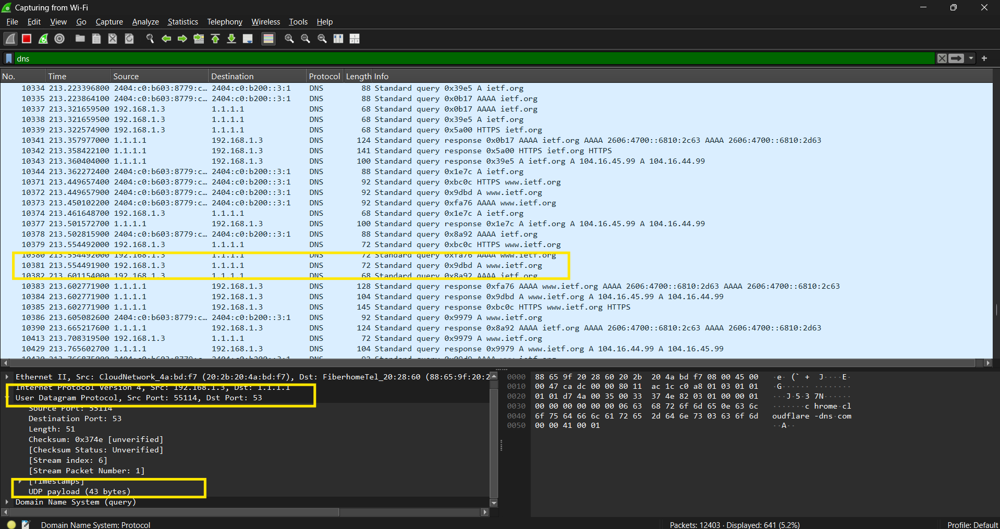
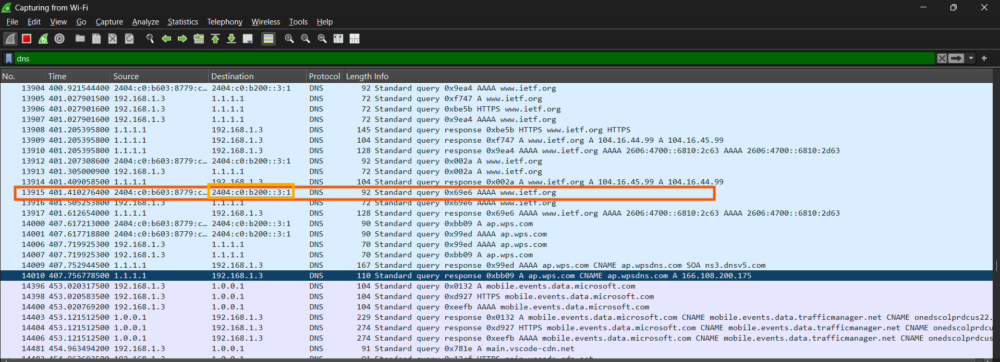
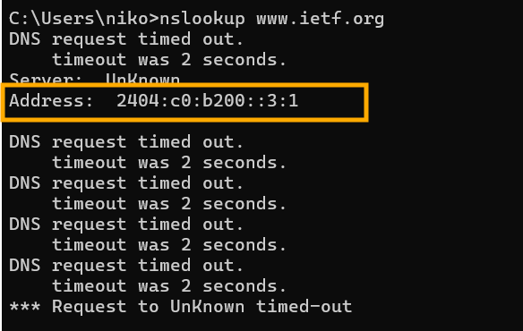
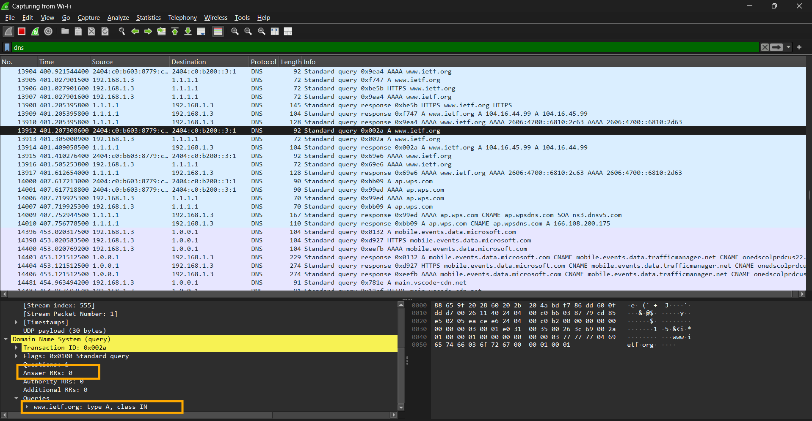
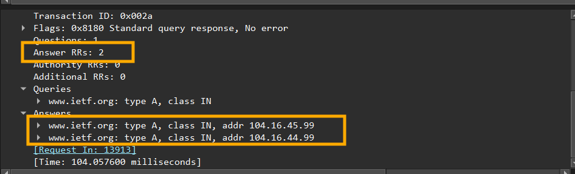
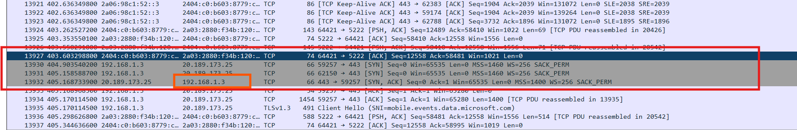
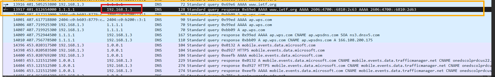
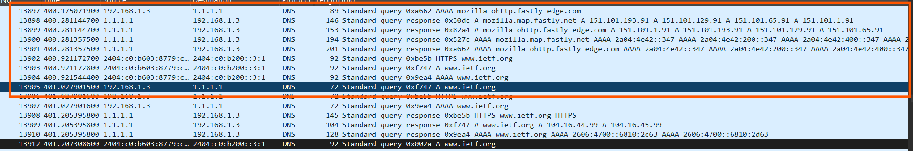

## Nama: Niko Rajani Syahputra Pane
## Kelas: IF-04-04
## NIM: 103072400167

# Pertanyaan 

## Pertanyaan Tracing DNS
Beberapa pertanyaan yang di ajukan adalah:
1. Cari pesan permintaan DNS dan balasannya. Apakah pesan tersebut dikirimkan melalui UDP atau TCP?
2. Apa port tujuan pada pesan permintaan DNS? Apa port sumber pada pesan balasannya?
3. Pada pesan permintaan DNS, apa alamat IP tujuannya? Apa alamat IP server DNS lokal anda (gunakan ipconfig untuk mencari tahu)? Apakah kedua alamat IP tersebut sama?
4. Periksa pesan permintaan DNS. Apa “jenis” atau ”type” dari pesan tersebut? Apakah pesan permintaan tersebut mengandung ”jawaban” atau ”answers”?
5. Periksa pesan balasan DNS. Berapa banyak ”jawaban” atau ”answers” yang terdapat di dalamnya? Apa saja isi yang terkandung dalam setiap jawaban tersebut?
6. Perhatikan paket TCP SYN yang selanjutnya dikirimkan oleh host Anda. Apakah alamat IP pada paket tersebut sesuai dengan alamat IP yang tertera pada pesan balasan DNS?
7. Halaman web yang sebelumnya anda akses (http://www.ietf.org) memuat beberapa gambar. Apakah host Anda perlu mengirimkan pesan permintaan DNS baru setiap kali ingin mengakses suatu gambar?
---

## Jawaban
### 1. Cari pesan permintaan DNS dan balasannya. Apakah pesan tersebut dikirimkan melalui UDP atau TCP?

Sebelum itu, kita perlu menjalankan IP Conifg untuk melihat IP addres di laptop kita dan melihat apakah ip kiat dapat menerima permintaan dari server. 

caranya cukup ketik di command prompt yaitu:

``` python 
ipconfig
```

lalu setelah itu, akan muncul alamat ip anda (IPv4)

Setelah itu kita bisa buka wireshark dan kemudian lakukan capture. 
kemudian buka web http://www.ietf.org di browser anda setelah itu lakukan filter, ketik 
```python
ip.addr == [IP KAMU]
```

Hasilnya:



Berdasarkan kotak kuning tersebut terlihta bahwa pesan permintaan di kirim melalui UDP (User Datagram Protokol)

### 2. Apa port tujuan pada pesan permintaan DNS? Apa port sumber pada pesan balasannya?

Jika dilihat dari gambar diatas, terlihat bahwa 

Port Tujuan = 53
Port Sumber = 55114

### 3. Pada pesan permintaan DNS, apa alamat IP tujuannya? Apa alamat IP server DNS lokal anda (gunakan ipconfig untuk mencari tahu)? Apakah kedua alamat IP tersebut sama?

Alamat IP tujuan dari web www.ietf.org adalah 2404:c0:b200::3:1 seperti yang terlihat di kotak berwarna orange ini:



dan yang saya temukan dengan menggunakn nslookup lewat query

```python
nslookup www.ietf.org
```
didapat hasilnya juga sama:




### 4. Periksa pesan permintaan DNS. Apa “jenis” atau ”type” dari pesan tersebut? Apakah pesan permintaan tersebut mengandung ”jawaban” atau ”answers”?

Berdasarkan gambar di bawah ini:




Pesan permintaan DNS berjenis A (Host Addres). Pesan permintaan tersebut tidak mengandung jawaban (Answers RRs: 0) atau answer karena bagian jawaban hanya bisa di isi oleh server nantinya saat membalas atau merespond permintaan dari web tersebut. 

### 5. Periksa pesan balasan DNS. Berapa banyak ”jawaban” atau ”answers” yang terdapat di dalamnya? Apa saja isi yang terkandung dalam setiap jawaban tersebut?

Balasan nya mengandung 2 jawaban, isinya seperti gambar di bawah ini:



### 6. Perhatikan paket TCP SYN yang selanjutnya dikirimkan oleh host Anda. Apakah alamat IP pada paket tersebut sesuai dengan alamat IP yang tertera pada pesan balasan DNS?

Alamat IP pada Paket TCP SYN (192.168.3.1):




dan alamat IP pada balasan dari DNS tadi:



Kesimpulannya: Alamat IP nya sama. 

### 7. Halaman web yang sebelumnya anda akses (http://www.ietf.org) memuat beberapa gambar. Apakah host Anda perlu mengirimkan pesan permintaan DNS baru setiap kali ingin mengakses suatu gambar?



Jawabanya adalah tidak. Host tidak perlu mengirim pesan permintaan DNS yang baru setiap kali ingin mengakses gambar, biasnya di akses semua sekali diawal, lalu disimpan ke cache lokal dalam masa kadaluarsa tertentu (atau kalau kita menghapusnya secara sengaja). 


