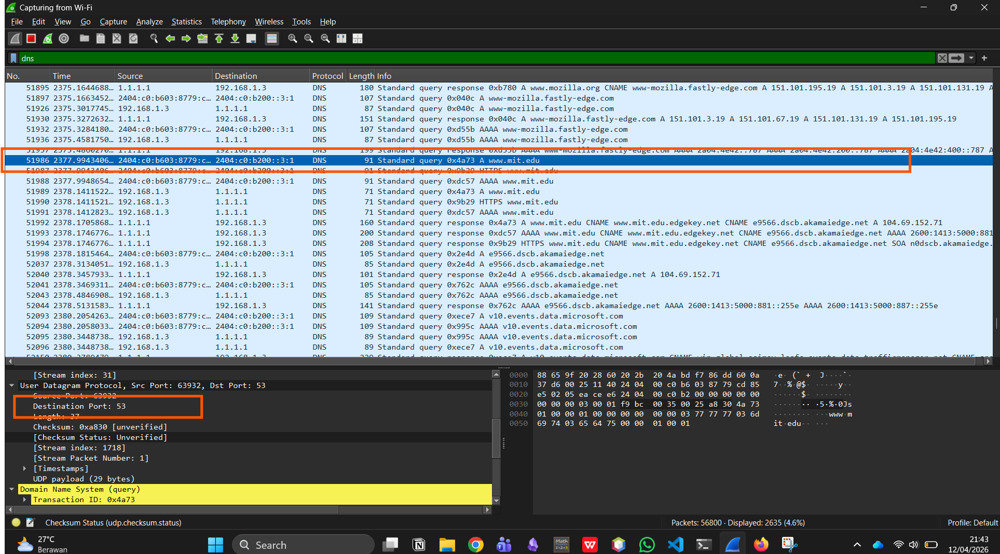
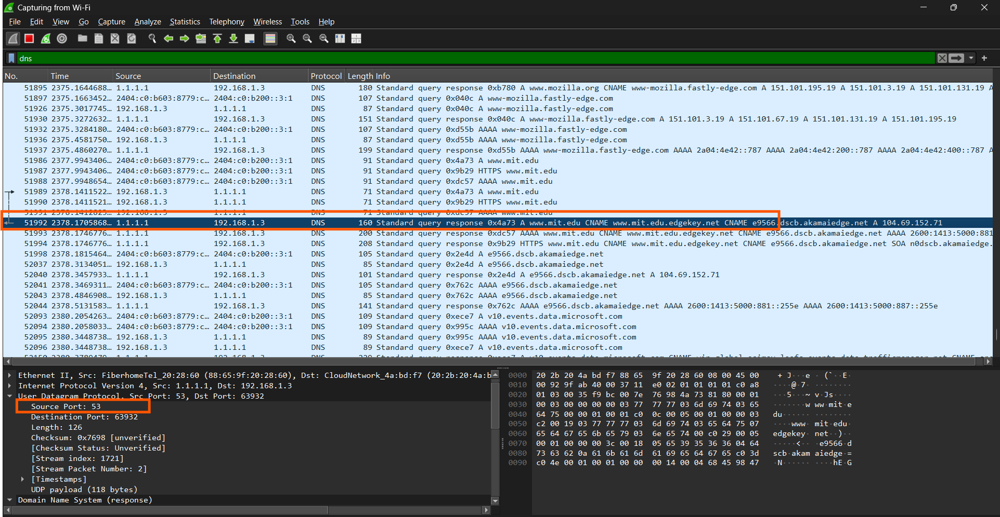
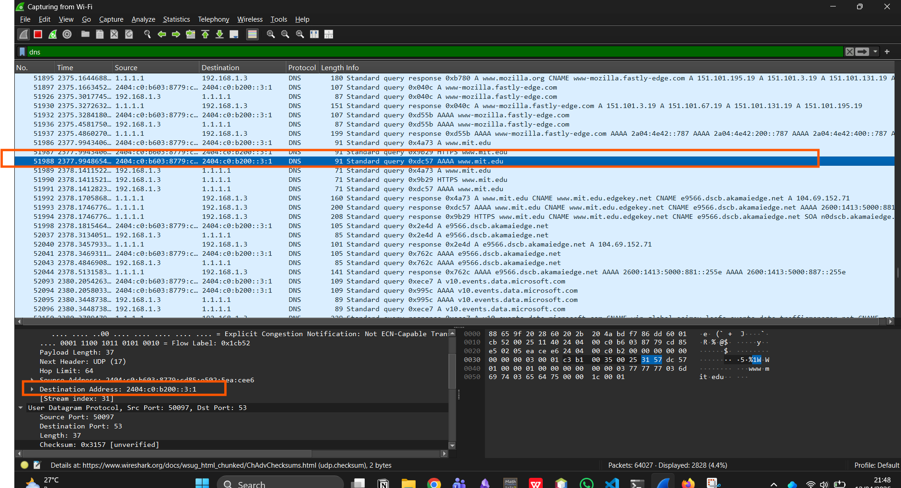
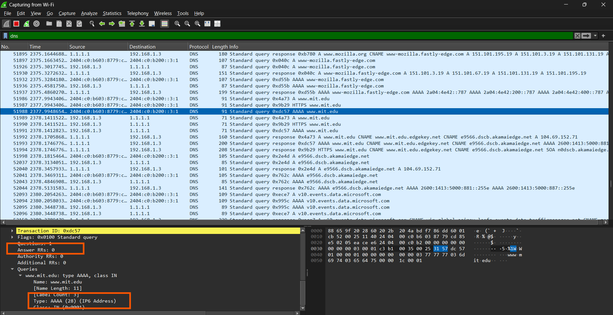
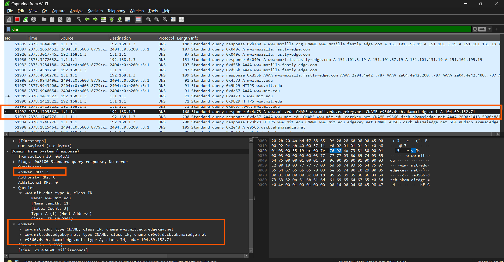

## Nama: Niko Rajani Syahputra Pane
## Kelas: IF-04-04
## NIM: 103072400167

# Pertanyaan 

## Pertanyaan NSLOOKUP lagi
Beberapa pertanyaan yang di ajukan adalah:
1. Apa port tujuan pada pesan permintaan DNS? Apa port sumber pada pesan balasan DNS?
2. Ke alamat IP manakah pesan permintaan DNS dikirimkan? Apakah alamat IP tersebut merupakan default alamat IP server DNS lokal Anda?
3. Periksa pesan permintaan DNS. Apa ”jenis” atau ”type” dari pesan tersebut? Apakah pesan 
tersebut mengandung ”jawaban” atau ”answers”?
4. Periksa pesan balasan DNS. Berapa banyak ”jawaban” atau “answers” yang terdapat di 
dalamnya. Apa saja isi yang terkandung dalam setiap jawaban tersebut?
5. Sertakan hasil tangkapan layar.

**Pertama tama, lakukan capture di wireshark, lalu buka website www.mit.edu, kemudian hentikan pengambilan paketnya.**

## Jawaban
### 1.  Apa port tujuan pada pesan permintaan DNS? Apa port sumber pada pesan balasan DNS?

Port Tujuan dan Port Destinationnya sama, yaitu 53

### 2. Ke alamat IP manakah pesan permintaan DNS dikirimkan? Apakah alamat IP tersebut merupakan default alamat IP server DNS lokal Anda?

DNS nya di kirim ke alamat IP  2404:c0:b200::3:1:

Dan itu alamat yang sama seperti yang ada di DNS lokal default saya:

### 3.  Periksa pesan permintaan DNS. Apa ”jenis” atau ”type” dari pesan tersebut? Apakah pesan tersebut mengandung ”jawaban” atau ”answers”?

Permintaan tersebut bertype AAA dan tidak megandung jawaban atau answer

### 4. Periksa pesan balasan DNS. Berapa banyak ”jawaban” atau “answers” yang terdapat di dalamnya. Apa saja isi yang terkandung dalam setiap jawaban tersebut?

di pesan balasannya, terdapat 3 jawaban yang isinya bisa terlihat seperti di bawah ini:

