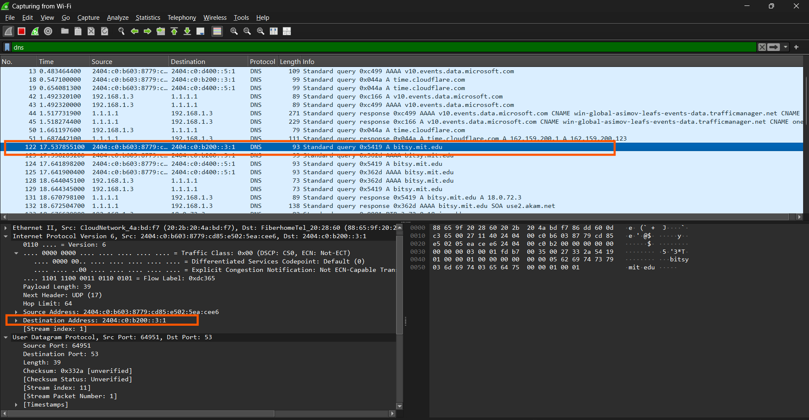
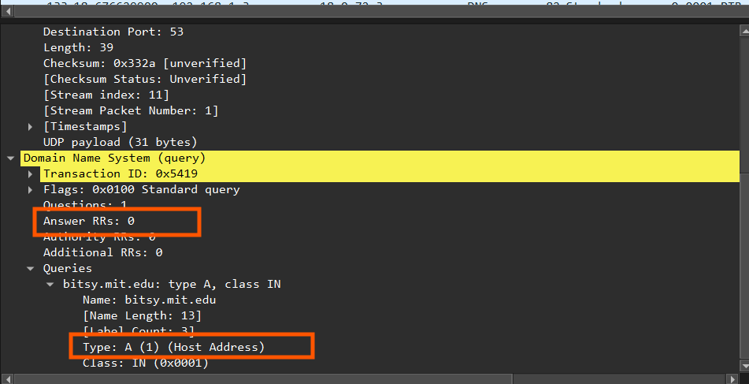
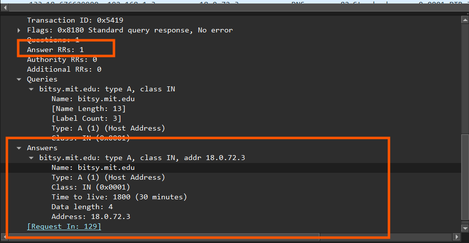

## Nama: Niko Rajani Syahputra Pane
## Kelas: IF-04-04
## NIM: 103072400167

# Pertanyaan 

## Pertanyaan nslookup www.aiit.or.kr bitsy.mit.edu
Beberapa pertanyaan yang di ajukan adalah:
1. Ke alamat IP manakah pesan permintaan DNS dikirimkan? Apakah alamat IP tersebut merupakan default alamat IP server DNS lokal Anda?
2. Periksa pesan permintaan DNS. Apa ”jenis” atau ”type” dari pesan tersebut? Apakah pesan tersebut mengandung ”jawaban” atau ”answers”?
3. Periksa pesan balasan DNS. Berapa banyak ”jawaban” atau “answers” yang terdapat di dalamnya. Apa saja isi yang terkandung dalam setiap jawaban tersebut?
---

## Jawaban
### 1. Ke alamat IP manakah pesan permintaan DNS dikirimkan? Apakah alamat IP tersebut merupakan default alamat IP server DNS lokal Anda?

alamat IP pesan permintaan terkirim tetap sama dengan default alamat IP server DNS di lokal saya sama seperti tugas sebelumnya

### 2. Periksa pesan permintaan DNS. Apa ”jenis” atau ”type” dari pesan tersebut? Apakah pesan tersebut mengandung ”jawaban” atau ”answers”?

tidak ada jawaban dan tipenya A (Host Addres)

### 3. Periksa pesan balasan DNS. Apa nama server MIT yang diberikan oleh pesan balasan? Apakah pesan balasan ini juga memberikan alamat IP untuk server MIT tersebut?

ada 1 pesan balasannya, pesannya dapat di lihat di gambar dibawah ini:

