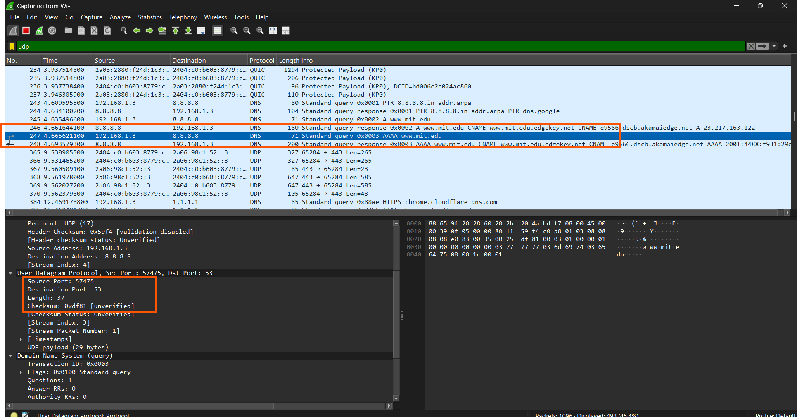
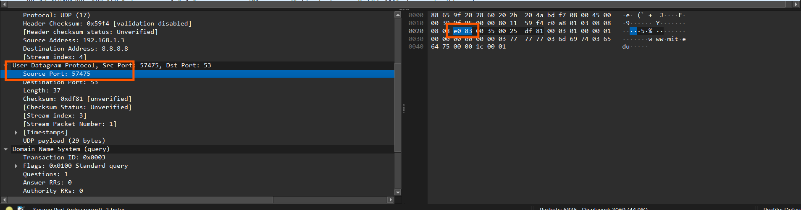
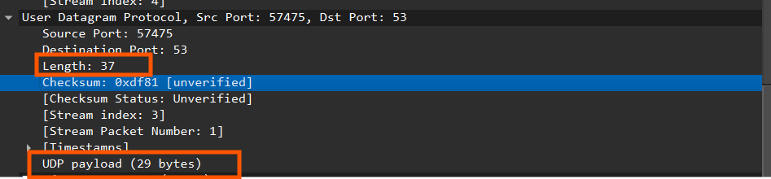
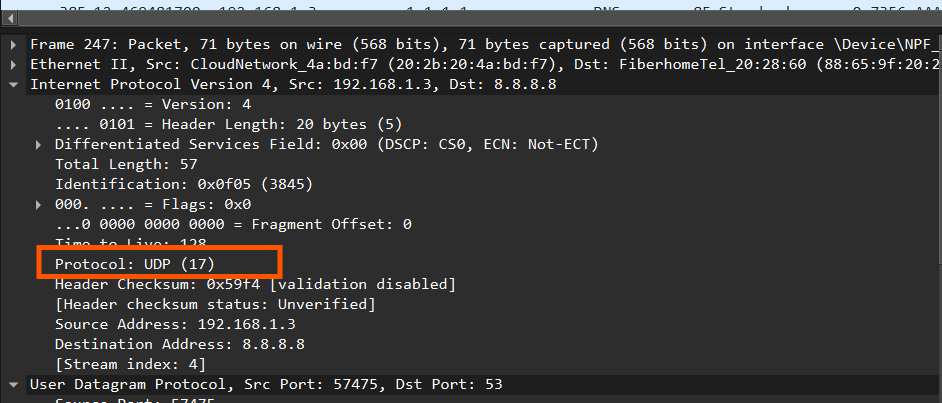
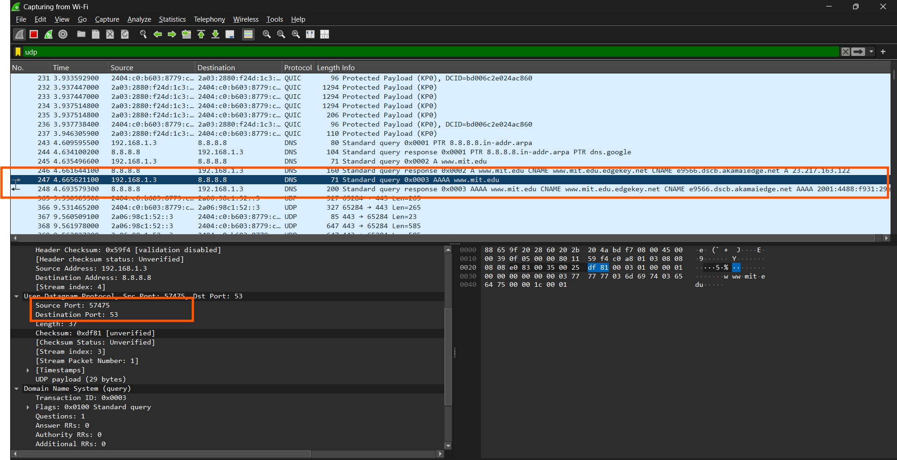
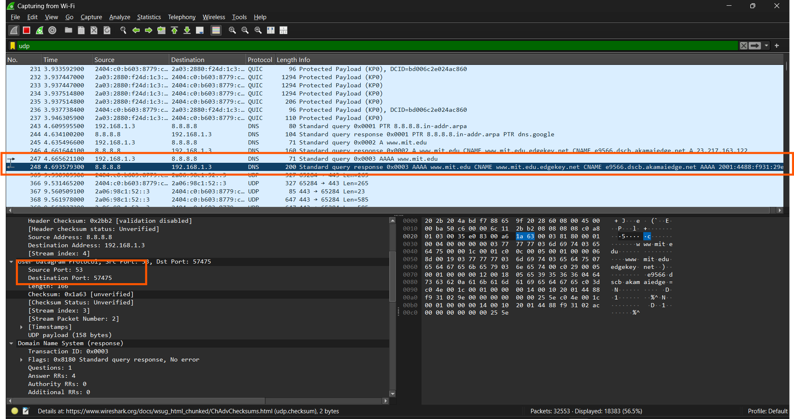

## Nama: Niko Rajani Syahputra Pane
## Kelas: IF-04-04
## NIM: 103072400167

# Pertanyaan 

## Pertanyaan UDP
Beberapa pertanyaan yang di ajukan adalah:
1. Pilih satu paket UDP yang terdapat pada trace Anda. Dari paket tersebut, berapa banyak “field” yang terdapat pada header UDP? Sebutkan nama-nama field yang Anda temukan!
2. Perhatikan informasi “content field” pada paket yang Anda pilih di pertanyaan 1. Berapa panjang (dalam satuan byte) masing-masing “field” yang terdapat pada header UDP?
3. Nilai yang tertera pada ”Length” menyatakan nilai apa? Verfikasi jawaban Anda melalui paket UDP pada trace.
4. Berapa jumlah maksimum byte yang dapat disertakan dalam payload UDP? (Petunjuk: jawaban untuk pertanyaan ini dapat ditentukan dari jawaban Anda untuk pertanyaan 2)
5. Berapa nomor port terbesar yang dapat menjadi port sumber? (Petunjuk: lihat petunjuk pada pertanyaan 4)
6. Berapa nomor protokol untuk UDP? Berikan jawaban Anda dalam notasi heksadesimal dan desimal. Untuk menjawab pertanyaan ini, Anda harus melihat ke bagian ”Protocol” pada datagram IP yang mengandung segmen UDP.
7. Periksa pasangan paket UDP di mana host Anda mengirimkan paket UDP pertama dan paket UDP kedua merupakan balasan dari paket UDP yang pertama. (Petunjuk: agar paket kedua JARINGAN KOMPUTER 31 merupakan balasan dari paket pertama, pengirim paket pertama harus menjadi tujuan dari paket kedua). Jelaskan hubungan antara nomor port pada kedua paket tersebut
---

Sebelum itu, pastikan sudah mengaktifkan Wireshark Wifinya, lalu kita akan menggunakan nslookup untuk menampilkan paket UDP nya. anda bisa ketik 

```python
nslookup www.mit.edu 
```

## Jawaban
### 1. Pilih satu paket UDP yang terdapat pada trace Anda. Dari paket tersebut, berapa banyak “field” yang terdapat pada header UDP? Sebutkan nama-nama field yang Anda temukan!

Terdapat 4 field yang ada di UDP hasil capture, yaitu:

- Destination Port
- Source Port
- Length
- Checksum




### 2. Perhatikan informasi “content field” pada paket yang Anda pilih di pertanyaan 1. Berapa panjang (dalam satuan byte) masing-masing “field” yang terdapat pada header UDP?

Masing Masing panjang field header UDP adalah 2 byte:

- Destination Port 2 byte
- Source Port 2 byte
- Length 2 byte
- Checksum 2 byte

Sehingga jika di total terdapat 8 byte dalam 1 paket UDP nya




### 3.  Nilai yang tertera pada ”Length” menyatakan nilai apa? Verfikasi jawaban Anda melalui paket UDP pada trace.

Nilai Length adalah gabungan dari Total field header UDP + UDP payload atau data yang di kirimkan dalam paket tersebut



Bisa di lihat bahwa Length nya = 37, yang dimana itu didapat dari
total Header UDP = 8 byte
UDP payload = 29 byte

Length = 8+29 = 37 byte. 

### 4. Berapa jumlah maksimum byte yang dapat disertakan dalam payload UDP? (Petunjuk: jawaban untuk pertanyaan ini dapat ditentukan dari jawaban Anda untuk pertanyaan 2)

Terdapat langkah langkah untuk menghitungnya

- field length dengan ukuran 2 byte = 16 bit
- Nilai Maksimum dari 16 bit = 2<sup>16</sup> - 1 = 65.535
- Kurangi dengan Header UDP nya

jadi rumusnya

Max Payload = Nilai Max Length - Ukuran Header UDP
Max Payload = 65.535 - 8
Max Payload = 65.527 byte

Jadi Maksimal Payload UDP nya adlaah 65.527 byte atau 64 kb.

### 5. Berapa nomor port terbesar yang dapat menjadi port sumber? (Petunjuk: lihat petunjuk pada pertanyaan 4)

Port Sumber juga punya ukuran yang sama yaitu 2 byte. 
Tetapi port tidak di kurangi dengan header, alasannya karena nomor port itu hanya label saja. 

jadi port terbesarnya adalah = 65.535

### 6. Berapa nomor protokol untuk UDP? Berikan jawaban Anda dalam notasi heksadesimal dan desimal. Untuk menjawab pertanyaan ini, Anda harus melihat ke bagian ”Protocol” pada datagram IP yang mengandung segmen UDP.

Nomor protokol UDP adalah 17, atau kalau dalam hexadesimal adalah 0x11. 



### 7. Periksa pasangan paket UDP di mana host Anda mengirimkan paket UDP pertama dan paket UDP kedua merupakan balasan dari paket UDP yang pertama. (Petunjuk: agar paket kedua JARINGAN KOMPUTER 31 merupakan balasan dari paket pertama, pengirim paket pertama harus menjadi tujuan dari paket kedua). Jelaskan hubungan antara nomor port pada kedua paket tersebut

suatu paket dikatakan pasangan (saling bertukar pesan), kalau Source portnya menjadi destination port di paket lain, begitu juga sebaliknya. 

Dalam wireshark, biasanya ada tanda panah masuk dan keluar, tanda panah masuk artinya permintaan sampai kepada server, lalu panah keluar menandakan bahwa permintaan nya di respon. 




Seperti dalam gambar diatas. 
Permintaannya punya source port 57475 dengan destination port = 53
sedangkan Paket responnya punya port yang kebalik, yaitu source port nya = 53 dan destination portnya = 57475 yang menandakan kedua paket saling berkomunikasi. 