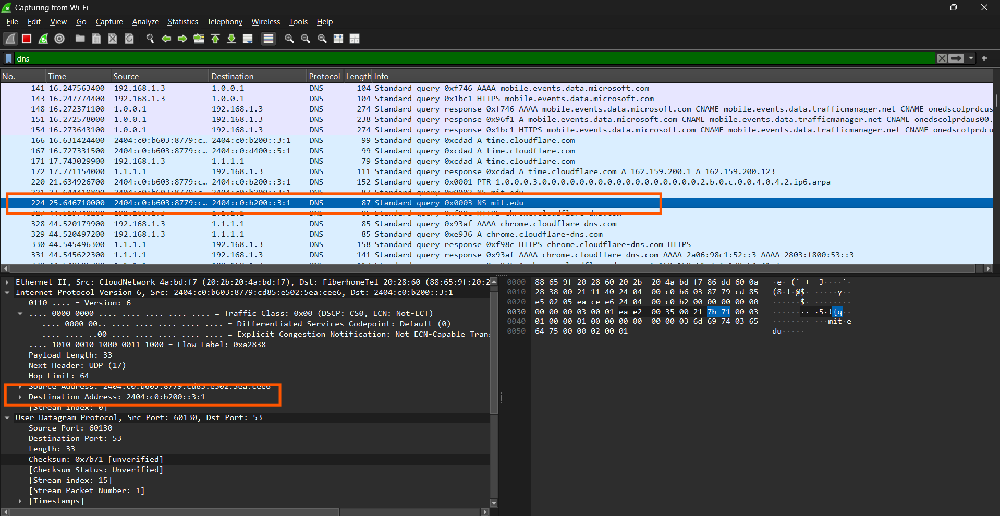
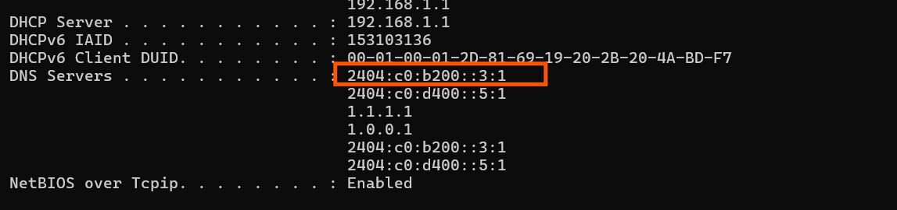
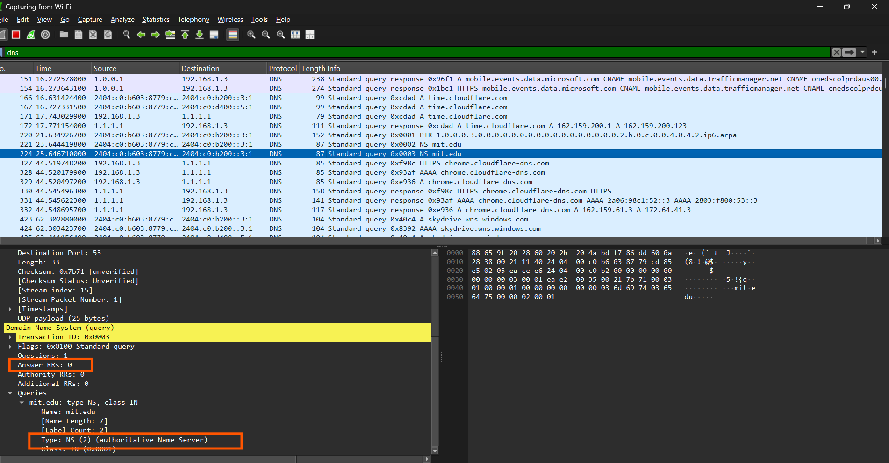

## Nama: Niko Rajani Syahputra Pane
## Kelas: IF-04-04
## NIM: 103072400167

# Pertanyaan 

## Pertanyaan nslookup –type=NS mit.edu
Beberapa pertanyaan yang di ajukan adalah:
1. Ke alamat IP manakah pesan permintaan DNS dikirimkan? Apakah alamat IP tersebut merupakan default alamat IP server DNS lokal Anda?
2. Periksa pesan permintaan DNS. Apa ”jenis” atau ”type” dari pesan tersebut? Apakah pesan 
tersebut mengandung ”jawaban” atau ”answers”?
3. Periksa pesan balasan DNS. Apa nama server MIT yang diberikan oleh pesan balasan? 
Apakah pesan balasan ini juga memberikan alamat IP untuk server MIT tersebut?
---

## Jawaban
### 1.   Ke alamat IP manakah pesan permintaan DNS dikirimkan? Apakah alamat IP tersebut merupakan default alamat IP server DNS lokal Anda?

alamat IP pesan permintaan terkirim tetap sama dengan default alamat IP server DNS di lokal saya sama seperti tugas sebelumnya

### 2. Periksa pesan permintaan DNS. Apa ”jenis” atau ”type” dari pesan tersebut? Apakah pesan 

tidak ada jawaban dan tipenya adalah NS (Name Server):

### 3. Periksa pesan balasan DNS. Apa nama server MIT yang diberikan oleh pesan balasan? Apakah pesan balasan ini juga memberikan alamat IP untuk server MIT tersebut?

ada beberapa nama server MIT di pesan balasan ini, yaitu:
mit.edu nameserver = asia1.akam.net
mit.edu nameserver = ns1-173.akam.net
mit.edu nameserver = asia2.akam.net
mit.edu nameserver = ns1-37.akam.net
mit.edu nameserver = eur5.akam.net
mit.edu nameserver = use2.akam.net
mit.edu nameserver = usw2.akam.net
mit.edu nameserver = use5.akam.net

dan pesan balasan ini tentu saja juga memberikan alamat IP untuk server MIT tersebut. 
