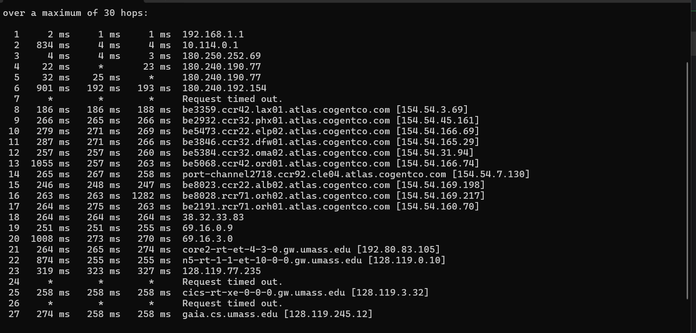
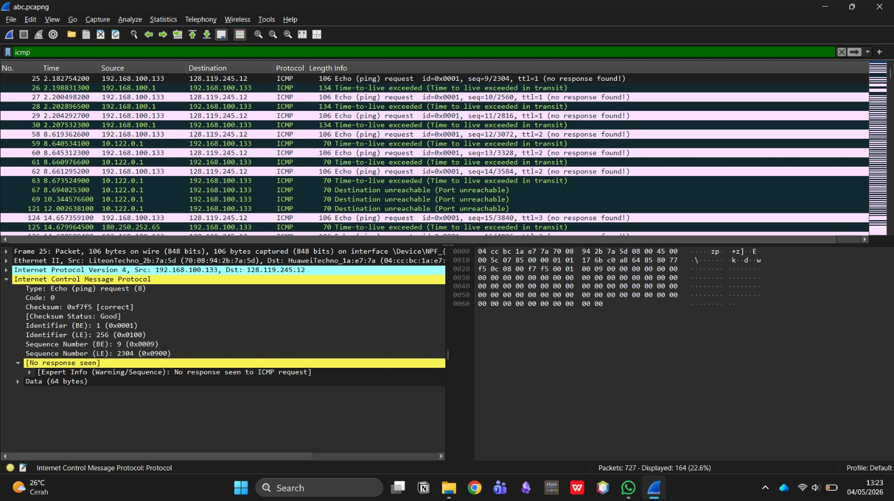
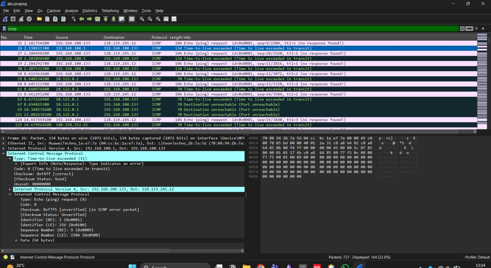
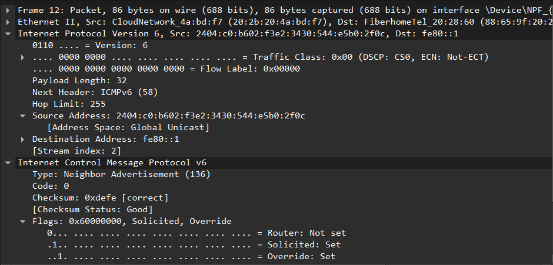

**Nama:** Niko Rajani Syahputra Pane  
**Kelas:** IF-04-04  
**NIM:** 103072400167

# Modul 10 - IPv4, IPv6, dan Traceroute

Pada modul ini, kita akan membahas mengenai cara kerja pelacakan rute (*route tracing*) menggunakan utility `tracert`, serta mengamati perbedaan antara struktur paket IPv4 dan IPv6, khususnya terkait dengan implementasi *Time-to-Live* (TTL) dan *Hop Limit*.

## 1. Menangkap Paket dari Eksekusi Traceroute

Pengujian pertama dilakukan untuk memetakan rute perjalanan paket data dari komputer lokal (*localhost*) menuju ke server tujuan, yaitu `gaia.umass.edu`. Pengujian ini dilakukan menggunakan utility bawaan Windows yang dijalankan melalui *Command Prompt*, yakni `tracert`.

Berdasarkan hasil tangkapan layar di atas, `tracert` mengirimkan serangkaian paket pelacakan untuk mengetahui jalur (router atau hop) mana saja yang dilewati oleh paket hingga mencapai tujuan. Setiap baris angka yang muncul merepresentasikan satu titik pemberhentian (router) di internet beserta waktu tempuhnya.

## 2. Pengamatan Paket IPv4 dan Konsep TTL

Dalam protokol IPv4, terdapat sebuah mekanisme yang disebut **Time-To-Live (TTL)**. TTL ini berfungsi sebagai "umur" bagi sebuah paket untuk mencegahnya berputar-putar tanpa batas di dalam jaringan (*routing loop*). Setiap kali paket melewati sebuah router (hop), nilai TTL akan dikurangi 1. Jika nilai TTL mencapai angka 0 sebelum paket sampai di tujuan, router akan membuang paket tersebut dan mengirimkan pesan peringatan kembali ke pengirim berupa *ICMP Time-to-live exceeded*.

Pada proses pelacakan awal, komputer kita sengaja mengirimkan paket *Echo Request* dengan nilai **TTL = 1**. Tujuannya adalah agar paket tersebut langsung "kadaluwarsa" di router pertama yang dilewati. Router pertama yang menerima paket ini akan mengurangi TTL menjadi 0, membuangnya, dan secara otomatis membalas dengan pesan *Time-to-live exceeded*. Melalui balasan inilah komputer kita dapat mengetahui alamat IP dari router pertama (hop ke-1) tersebut.

Bagaimana cara mengetahui router selanjutnya? Untuk melacak rute kedua, ketiga, dan seterusnya, komputer kita akan terus mengirimkan paket baru dengan nilai TTL yang terus ditambahkan (TTL=2, TTL=3, dst.). 

Sebagai contoh pada gambar di atas, ketika paket dikirimkan dengan **TTL = 2**, paket tersebut berhasil melewati router pertama (karena TTL dikurangi menjadi 1), namun akan kadaluwarsa di router kedua. Router kedua tersebut kemudian akan mengirimkan pesan balasan *ICMP Time-to-live exceeded*, sehingga komputer kita berhasil mengidentifikasi keberadaan router kedua. Proses iteratif penambahan nilai TTL ini terus berlanjut hingga akhirnya paket mencapai server tujuan akhir dengan selamat tanpa kehabisan TTL.

## 3. Pengamatan Paket IPv6

Selanjutnya, kita juga melakukan pengamatan sekilas pada struktur datagram dari IPv6 menggunakan Wireshark.

Berbeda dengan IPv4 yang menggunakan format desimal sepanjang 32-bit, alamat sumber (*Source Address*) dan alamat tujuan (*Destination Address*) pada IPv6 menggunakan format heksadesimal dengan panjang 128-bit. Hal ini ditujukan untuk menyediakan ruang alamat IP yang jauh lebih masif karena alamat IPv4 di dunia sudah hampir habis.

Selain itu, jika pada IPv4 kita mengenal bidang **Time-To-Live (TTL)**, pada IPv6 bidang ini telah berganti nama menjadi **Hop Limit**. Walaupun namanya berbeda, fungsinya tetap persis sama, yaitu membatasi jumlah hop maksimum yang dapat dilewati paket di jaringan.

Dapat disimpulkan bahwa struktur *header* pada IPv6 dirancang agar jauh lebih ringkas atau "bersih" jika dibandingkan dengan IPv4. Beberapa bidang yang dulunya ada di IPv4 (seperti *Header Checksum* dan *Fragmentation*) telah dihilangkan dari *header* utama IPv6. Desain yang lebih sederhana ini bertujuan untuk mengurangi beban pemrosesan pada setiap router, sehingga proses pengiriman data (*routing*) di internet menjadi jauh lebih efisien dan cepat.

---

## 4. Kesimpulan

Mekanisme pelacakan jalur (*route tracing*) sangat bergantung pada trik manipulasi nilai **TTL** pada IPv4 atau **Hop Limit** pada IPv6. Dengan memanfaatkan pesan *error* protokol ICMP Tipe 11 (*Time-to-live exceeded*), perangkat pengirim dapat dengan pintar memetakan identitas setiap router perantara selangkah demi selangkah hingga paket sampai ke tujuan akhir. Di sisi lain, dari pengamatan pada IPv6 dapat dilihat adanya evolusi desain struktur paket jaringan yang lebih efisien dan modern, guna mengakomodasi lalu lintas internet saat ini yang kian padat dan membutuhkan performa maksimal.
