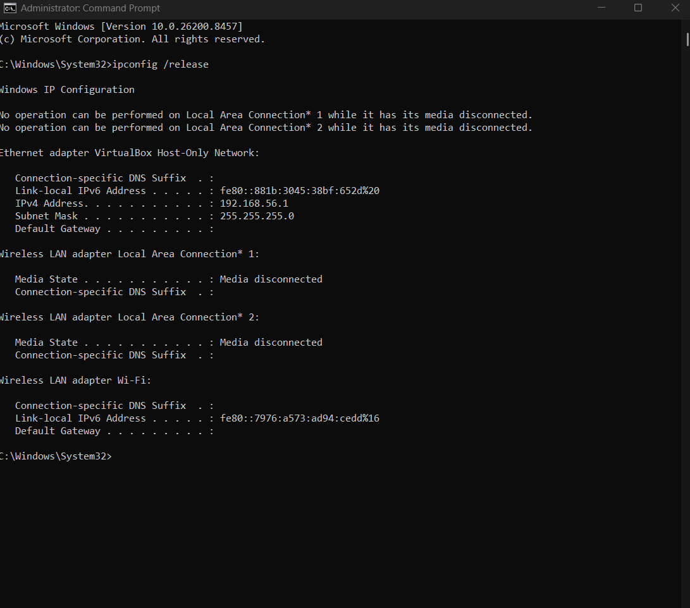
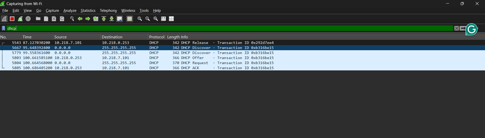
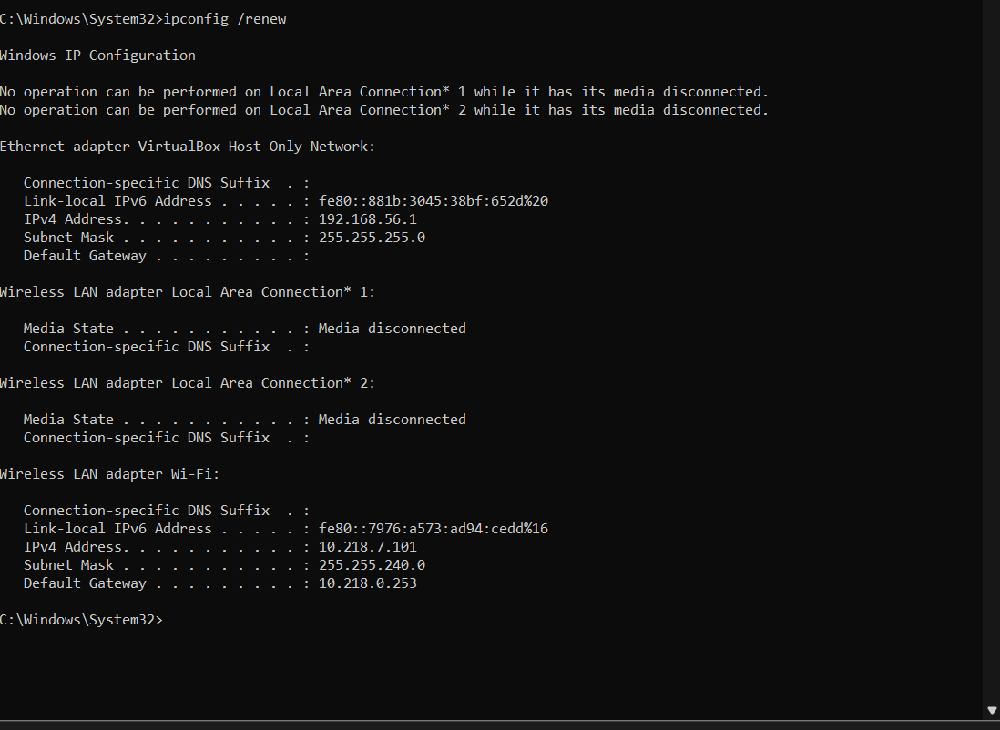

**Nama:** Niko Rajani Syahputra Pane  
**Kelas:** IF-04-04  
**NIM:** 103072400167  

# Modul 11 - DHCP (Dynamic Host Configuration Protocol)

Pada modul ini, kita akan membahas mengenai mekanisme DHCP menggunakan Wireshark. Melalui praktikum ini, kita dapat mengamati bagaimana sebuah perangkat klien mendapatkan konfigurasi alamat IP (*IP address*) secara otomatis tanpa perlu melakukan konfigurasi manual, serta menganalisis struktur pesan yang terjadi di dalam jaringan.

---

## 1. Dasar Teori (Proses DORA)


**DHCP (Dynamic Host Configuration Protocol)** beroperasi pada protokol UDP (port 67/68) untuk mendistribusikan alamat IP dan parameter jaringan secara otomatis ke perangkat baru melalui **proses DORA**:

1. **DHCP Discover**: Klien menyiarkan (*broadcast*) pencarian server DHCP (asal `0.0.0.0` ke tujuan `255.255.255.255`).
2. **DHCP Offer**: Server menawarkan IP potensial beserta konfigurasi jaringan ke klien.
3. **DHCP Request**: Klien menyiarkan persetujuan atas tawaran IP tersebut.
4. **DHCP ACK**: Server mengonfirmasi peminjaman (*lease*) IP, lalu klien mengaktifkan konfigurasinya.

---

## 2. Langkah Praktikum

Pengamatan mekanisme DHCP dilakukan dengan merekayasa pelepasan dan permintaan alamat IP baru pada sistem operasi melalui terminal, yang kemudian direkam menggunakan Wireshark. Langkah-langkahnya adalah sebagai berikut:

1. Buka Wireshark dan pilih interface jaringan lokal yang sedang aktif (WIFI).
2. filter `dhcp` pada Wireshark agar hanya paket-paket DHCP saja yang ditampilkan.
3. Buka terminal (*Command Prompt*) dengan  (*Run as Administrator*).
4. Jalankan perintah untuk melepaskan alamat IP yang saat ini sedang digunakan:
   ```cmd
   ipconfig /release



5. Mulai proses tangkap paket (start capture) pada Wireshark.



6. Jalankan perintah berikut di terminal untuk meminta alokasi alamat IP baru dari DHCP server:



7. Terakhir stop capture yang ada di wireshark agar tidak mengambil ip yang baru.

## 3. Analisis Paket DHCP
Berdasarkan hasil tangkapan paket (trace) di Wireshark, dilakukan analisis mendalam terhadap aktivitas lalu lintas DHCP yang terekam di wireshark sebelumnya

A. Proses DORA Utama
Dari tangkapan layar Wireshark, siklus inisialisasi DHCP berjalan secara berurutan:

- **Discover**: Klien mengirimkan pesan broadcast dengan Source IP 0.0.0.0 menuju Destination IP 255.255.255.255 karena perangkat benar-benar belum memiliki identitasnya.

- **Offer**: DHCP Server merespons dari alamat IP miliknya (misal: 10.218.0.253 atau 192.168.1.1) dengan mengirimkan penawaran ke alamat IP tujuan yang dialokasikan untuk klien.

- **Request**: Klien kembali mengirimkan pesan broadcast untuk mengonfirmasi pilihan alamat IP yang akan disewanya dari server.

- **ACK**: Server mengirimkan paket konfirmasi akhir, menandakan bahwa siklus DORA selesai dan alamat IP resmi dikonfigurasi pada perangkat klien.


Seluruh paket permintaan dan balasan DHCP ini dipastikan tidak tertukar di lalu lintas jaringan berkat token heksadesimal unik yang tercatat pada Transaction ID di dalam header DHCP(seperti 0x292d7ee4), serta terdapat informasiIP sewaan pada Client IP Address.

Setelah klien berhasil memegang identitas logis, hubungan komunikasi berlanjut secara langsung (unicast). Pada baris trace 36-37, terekam proses DHCP Renewal di mana klien mengirimkan paket Request secara mandiri untuk memperpanjang waktu pinjam (lease time), yang langsung disetujui server via paket ACK.

Alur DHCP ini berakhir ketika perintah ipconfig /release dieksekusi (terekam pada baris 41), di mana klien menembakkan paket DHCP Release secara unicast untuk mengosongkan status IP-nya sendiri dan mengembalikan alokasi tersebut ke pool milik server. Keadaan tanpa identitas setelah di lepas itu langsung memicu sistem operasi klien (terekam pada baris 42-46) untuk otomatis mengulangi kembali siklus permintaan alamat IP baru dari awal melalui pelemparan paket DHCP Discover.

## 4. Kesimpulan
Mekanisme kerja protokol DHCP bergantung pada sifat connectionless dari UDP dan penggunaan alamat broadcast (255.255.255.255) pada fase awal (Discover dan Request), mengingat klien belum memiliki identitas IP yang valid di dalam jaringan. Penggunaan Transaction ID sangat penting agar konfigurasi parameter jaringan dari server tidak tertukar antar perangkat.