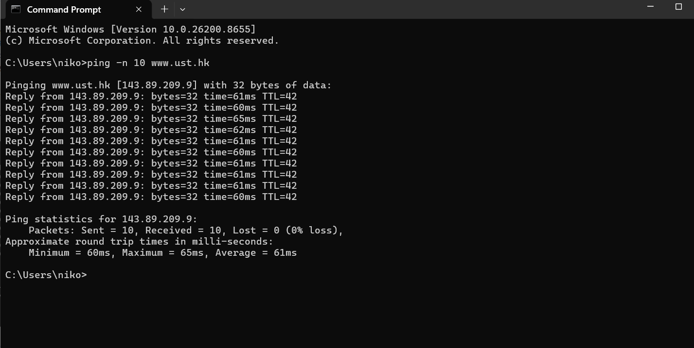
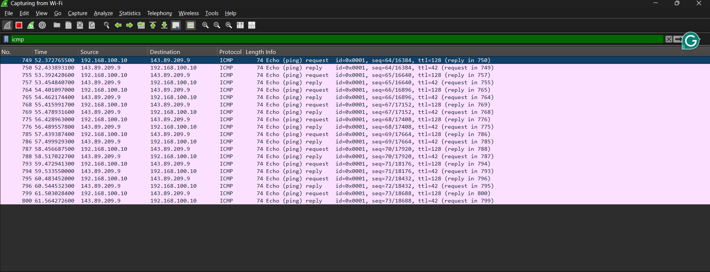
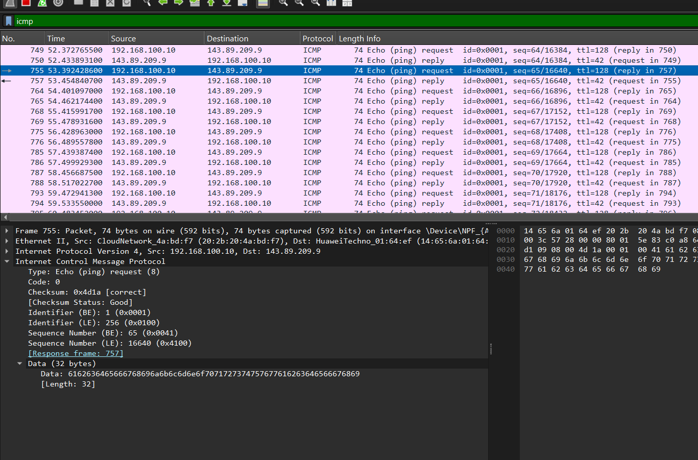
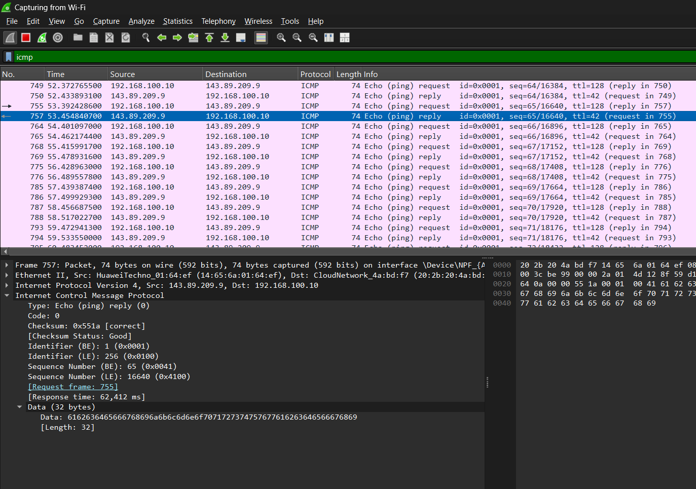
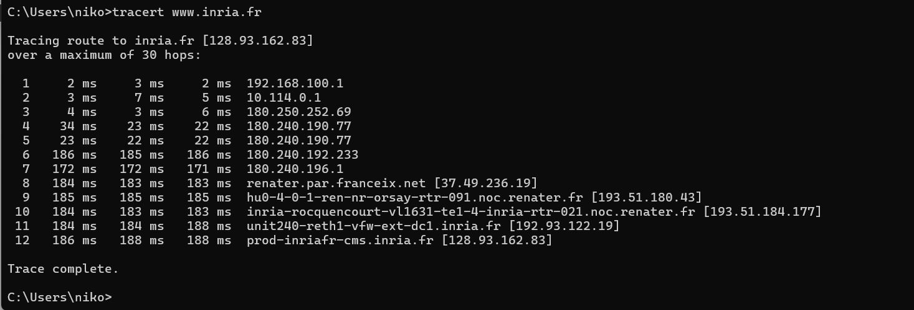
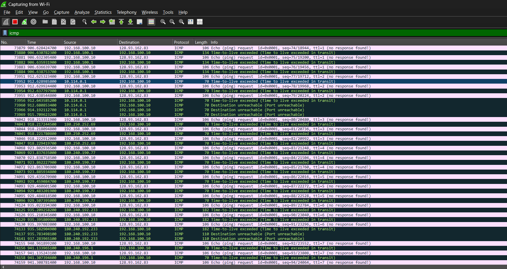
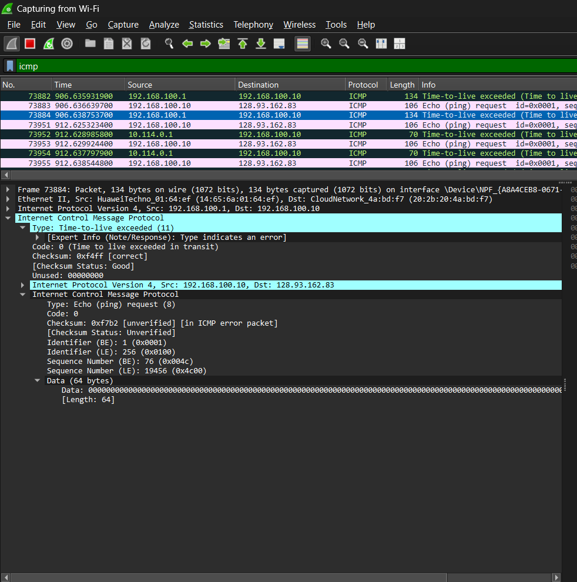

**Nama:** Niko Rajani Syahputra Pane  
**Kelas:** IF-04-04  
**NIM:** 103072400167  

# Modul 12 - ICPM (Internet Control Message Protocol)

ICMP (Internet Control Message Protocol) adalah protokol jaringan yang digunakan untuk mengirim pesan kontrol, diagnosa, dan laporan kesalahan antar perangkat di internet.

Struktur Header ICMP (8 Byte Pertama) terdiri atas:
- **Type (Jenis):** 1 byte, menentukan jenis pesan ICMP (misal: 0 untuk Echo Reply, 8 untuk Echo Request).
- **Code (Kode):** 1 byte, menentukan sub-jenis pesan ICMP.
- **Checksum:** 2 byte, digunakan untuk mendeteksi kesalahan pada header ICMP.
- **Rest of Header:** 4 byte, tergantung pada jenis pesan ICMP, bisa berisi informasi seperti ID dan Sequence Number untuk Echo Request/Reply, atau data tambahan untuk jenis pesan lainnya.

## PING 
Ping (Packet Internet Groper) adalah utilitas jaringan yang digunakan untuk menguji apakah sebuah perangkat (seperti komputer, server, atau router) terhubung ke jaringan dan dapat dijangkau.
ping bekerja seperti sistem sonar kapal selam: perangkat Anda mengirimkan sinyal, lalu menunggu sinyal tersebut memantul kembali.

# Tahap Implementasi ICMP & Ping

1. Gunakan Perintah 'ping -n 10 www.ust.hk' untuk mengecek apakah website www.ust.hk dapat dijangkau. Berikut adalah hasil dari perintah tersebut:

Terdapat reply yang menandakan bahwa website www.ust.hk dapat dijangkau.

2. Masuk ke wireshark, jalankan capture dan filter 'ICMP'

BErdasarkan tangkapan layar diatas, terdapat 20 paket, karena kiat menggunakan perintah -n 10 yaitu instrukisi agar laptop mengirim kan paket sebanyak 10 kali, yang dimana 1 paket terdiri dari request dan reply. 

3. Cek paket yang mengandung info request

Terlihat aktivitas protokol ICMP berupa pesan Type 8 Code 0 (Echo ping request) yang dikirim oleh 192.168.100.10 (host) menuju server tujuan 143.89.209.9. Paket permintaan ini membawa payload data sebesar 32 bytes.

4. Cek paket yang mengandung info reply

Diterima paket balasan berjenis Type 0 Code 0 (Echo ping reply) yang diteruskan oleh server 143.89.209.9 kembali kepada 192.168.100.10 (host). Respons ini merespons langsung permintaan dari Frame 755, dengan catatan waktu respons (Response time) mencapai 62.412 ms. Server membalas dengan payload data yang serupa yakni 32 bytes, hal ini mengindikasikan bahwa paket sukses melakukan perjalanan pergi-pulang menembus sejumlah hop di jalur internet tanpa menderita packet loss sedikit pun.

Oleh karena itu, bisa disimpulkan bahwa interaksi komunikasi tersebut terjalin secara sukses. Bukti keberhasilan ini tampak dari relasi langsung dengan paket balasan di Frame 755 (Echo ping reply), yang memastikan ketersediaan konektivitas dua arah yang baik antara host dan 
server yang dituju.

# Analisi Paket ICMP Traceroute

Skenario kedua dilakukan dengan cara  mengeksekusi perintah tracert www.inria.fr. Ini bekerja dengan memanfaatkan manipulasi nilai TTL (Time to Live) pada header IP secara inkremental (dimulai dari TTL = 1).

1. Ketik perintah 'tracert www.inria.fr' pada terminal dan lihat hasilnya.

Hasilnya kita berhasil mengidentifikasi rute hop awal dengan informasi latensi masing-masing hop.

- Hop 1: 192.168.100.1 dengan waktu respon super cepat yaitu 1 ms.
- Hop Berikutnya dimana paket akan di teruskan keluar dari jaringan lokal
- ke jaringan penyedia layanan internet (ISP) publik sebelum di arahkan ke rute international. 

2. Buka wireshark dan filter lagi 'icmp' untuk mengecek paket yang terkandung dengan info yang sama seperti nomor 3 pada bagian ping

Berdasarkan tangkapan log paket pada Wireshark di atas, dapat dilihat bahwa perintah `tracert` bekerja dengan cara mengirimkan serangkaian paket dengan menaikkan nilai TTL (Time-to-Live) secara bertahap. Pengiriman dimulai dari nilai TTL=1, dan terus meningkat untuk melacak jalur menuju IP server tujuan (128.93.168.83). Setiap kali paket melintasi sebuah router (hop), router tersebut akan mengurangi nilai TTL pada paket sebesar 1. Ketika nilai TTL tersebut habis (mencapai nol) sebelum tiba di tujuan, router yang menanganinya akan membuang paket tersebut dan mengirimkan pesan balasan ICMP berupa Type 11 (Time-to-live exceeded) ke host pengirim. 

Dari serangkaian pesan balasan ini, host pengirim mampu mencatat dan merekam alamat IP dari setiap hop atau router yang dilewati paket. Melalui mekanisme tersebut, keseluruhan rute jalur jaringan dari komputer lokal hingga menuju server tujuan dapat teridentifikasi dan dipetakan secara berurutan.

3. cek salah satu paket ICMP nya

Berdasarkan detail paket pada tangkapan layar di atas, paket balasan dari router perantara selama proses `tracert` tercatat memiliki pesan galat ICMP **Type 11 (Time-to-live exceeded)** akibat kehabisan nilai TTL di tengah jalan. Hal terpenting dari pesan balasan ini adalah disertakannya salinan *IP header* dan sebagian *payload* asli dari host pengirim oleh router tersebut. Melalui identifikasi *Source IP* dari router dan pencocokan salinan *header* asli ini, komputer lokal dapat memverifikasi secara pasti paket *request* mana yang gagal dan mencatat IP router bersangkutan, sehingga keseluruhan rute jaringan menuju server tujuan dapat dipetakan secara akurat dan berurutan.

## Kesimpulan 

Secara keseluruhan, praktikum Modul 12 ini menunjukkan bahwa protokol ICMP sangat penting karena menjadi dasar dari perintah jaringan seperti ping dan tracert. Perintah ping menggunakan pesan ICMP Echo Request (Type 8) dan Echo Reply (Type 0) untuk mengecek apakah dua perangkat dapat saling terhubung dengan baik. Di sisi lain, perintah tracert bekerja dengan mengubah batas waktu hidup paket (TTL) secara bertahap, sehingga setiap router di tengah jalan akan mengirimkan pesan balasan ICMP Time Exceeded (Type 11). Melalui pengamatan di Wireshark, kita bisa melihat bahwa mekanisme balasan ICMP ini sangat membantu kita dalam memetakan jalur jaringan, melihat masalah pada paket yang hilang, serta menemukan letak gangguan di jaringan dengan lebih mudah dan jelas.