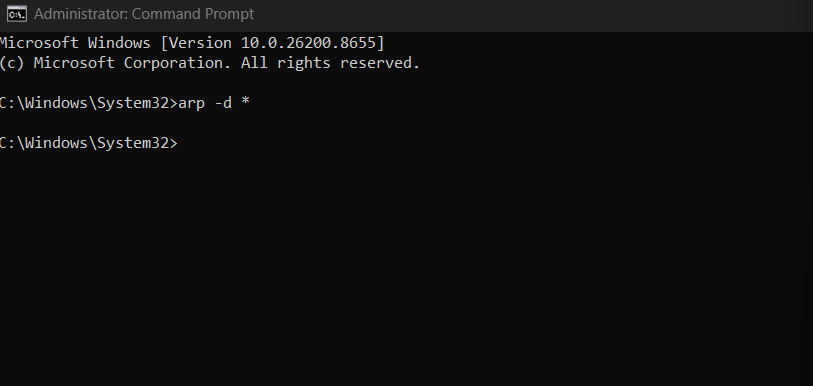
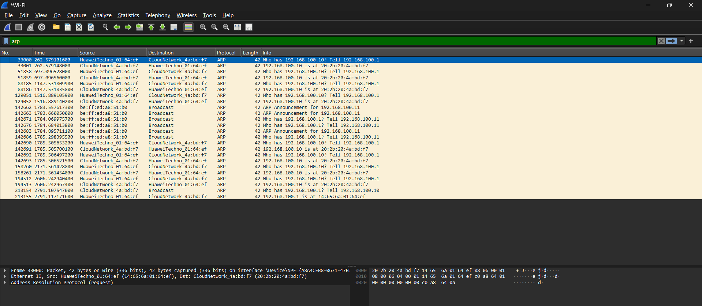
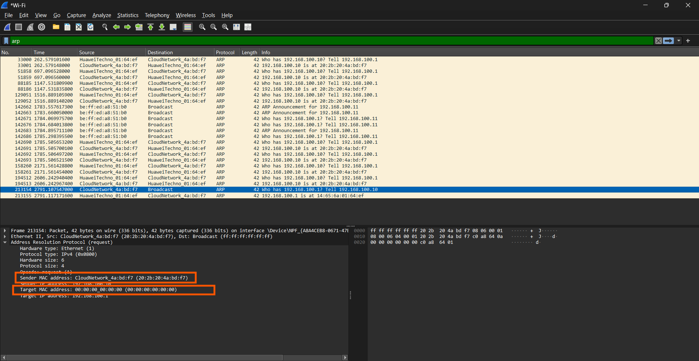
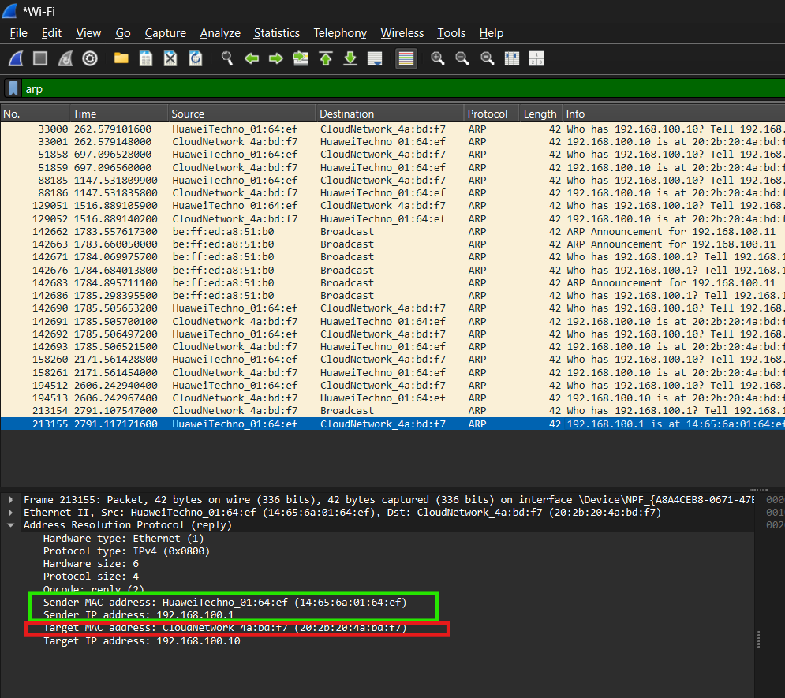

**Nama:** Niko Rajani Syahputra Pane  
**Kelas:** IF-04-04  
**NIM:** 103072400167  

# Modul 13 Caching ARP (Address Resolution Protocol)

Caching ARP (Address Resolution Protocol Caching) adalah proses penyimpanan sementara pemetaan antara Alamat IP (Layer 3) dan Alamat MAC (Layer 2) di dalam memori lokal sebuah perangkat (seperti komputer, router, atau switch)

Untuk memulai, langkah pertama yang diperlukan adalah menghapus cache ARP:

- Untuk windows gunakan perintah ```arp -d * ```. Bendera –d mengindikasikan operasi penghapusan, dan * adalah wildcard yang mengatakan untuk menghapus semua entri tabel.

- Untuk MacOS gunakan perintah ```sudo arp -d -a```. Biasanya akan di mintai pasword agar dapat akses ke root.

- untuk linux gunakan perintah ```sudo ip neighbor flush all```. Perintah ini bekerja serupa dengan perintah ```arp -d ``` namun dengan syntax yang berbeda. 

Setelah di hapus kiat akan menganalisis paket ARP itu 

# Analisis paket ARP 

Setelah anda hapus, menggunakan perintah di atas (disesuaikan dengan sistem operasi yang dimiliki), maka hasilnya adalah:



Jika tidak muncul pesan apapun, maka penghapusan berhasil

selanjutnya ikuti langkah langkah berikut:

1. Buka URL  http://gaia.cs.umass.edu/wireshark-labs/HTTP-ethereal-lab-file3.html Pada browser Anda. 


2. Saat halaman berhasil di muat, langsung bukawireshark untuk mulai merekam aktivitas jaringan yang terjadi


3. Stop capture paket wiresharknya & filter 'arp



4. Pilih Analyze -> Enabled Protocols. Kemudian hapus centang pada kotak IP dan pilih OK. Hal ini bertujuan untuk mengurangi paket-paket lain yang tidak relevan sehingga proses pengamatan dan analisis paket ARP menjadi lebih mudah dilakukan.

5. pilih paket dengan Destination **Broadcast**:



Bisa terlihat terdapat sender MAC Address (laptop) yaitu 20:2b:20:4a:bd:f7 dan terdapat MAC address tujuan yang masih belum di ketahui sehingga nilainya 00:00:00:00:00:00:00

Paket ARP Request dikirim secara broadcast untuk mencari MAC address dari host dengan IP 192.168.100.1. Karena paket dikirim secara broadcast, alamat MAC tujuan pada Ethernet frame bernilai ff:ff:ff:ff:ff:ff, yang berarti paket tersebut dikirim ke seluruh perangkat dalam jaringan lokal agar perangkat yang memiliki IP 192.168.100.1 dapat memberikan balasan (ARP Reply). 

6. Cek Reply ARP nya (Frame dibawah BroadCast tadi)



Pada pesan balasan (ARP Reply) ini, perangkat yang sedang dicari (yaitu perangkat dengan IP 192.168.100.1) akhirnya merespons. Perangkat tersebut menginformasikan bahwa alamat fisik (MAC address) miliknya adalah `14:65:6a:01:64:ef`. Jawaban ini dikirimkan langsung kembali ke laptop kita sebagai pihak pencari, yang diketahui memiliki IP 192.168.100.10 dan MAC address `20:2b:20:4a:bd:f7`. Melalui proses saling berbalas ini, laptop kita dapat mengetahui dan menyimpulkan dengan pasti bahwa alamat IP 192.168.100.1 berpasangan secara tepat dengan MAC address `14:65:6a:01:64:ef`.


## Kesimpulan
Secara keseluruhan, praktikum Modul 13 ini menunjukkan peran penting protokol ARP (Address Resolution Protocol) sebagai penerjemah yang menjembatani antara alamat IP dan alamat fisik (MAC address) pada jaringan lokal. Melalui percobaan menghapus memori cache ARP dan merekam aktivitas jaringan menggunakan Wireshark, kita dapat mengamati secara langsung bagaimana proses pencarian alamat ini bekerja. Pada tahap awal, komputer kita mengirimkan pesan pencarian (ARP Request) ke seluruh perangkat di jaringan secara serentak (broadcast) untuk bertanya "Siapa pemilik IP ini?". Setelah itu, perangkat yang merasa memiliki IP tersebut akan menjawab (ARP Reply) secara langsung kepada kita (unicast) sambil memberikan MAC address miliknya. Proses komunikasi tanya-jawab inilah yang memastikan bahwa setiap data dapat diantarkan ke perangkat fisik yang tepat sasaran di dalam jaringan.