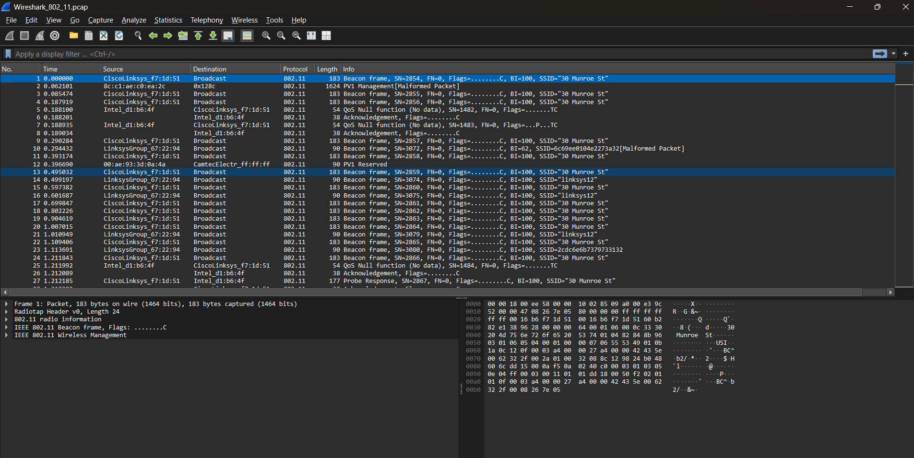
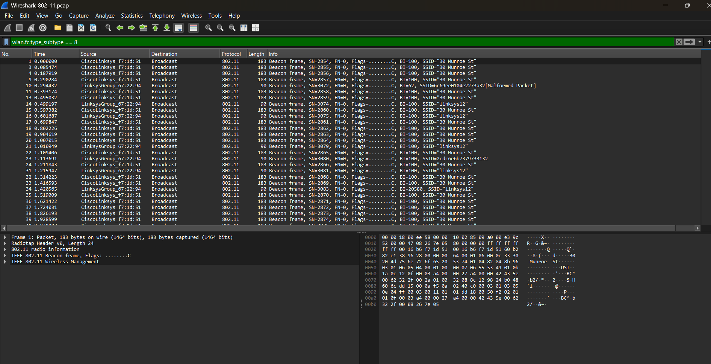
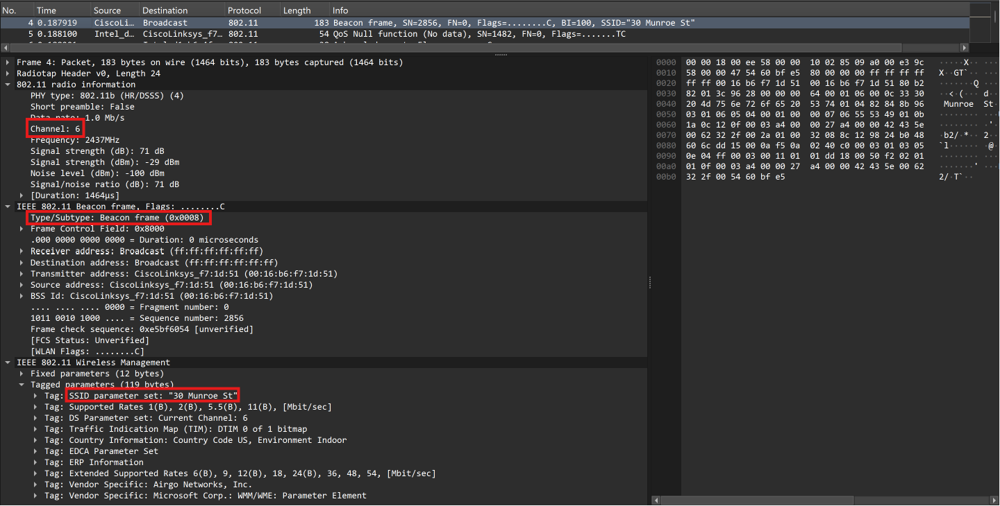
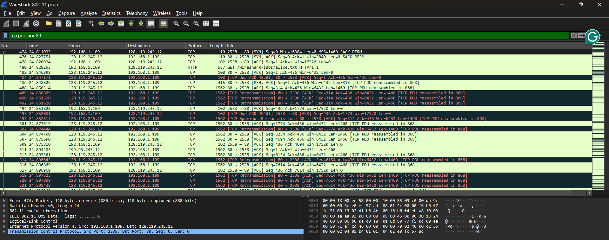
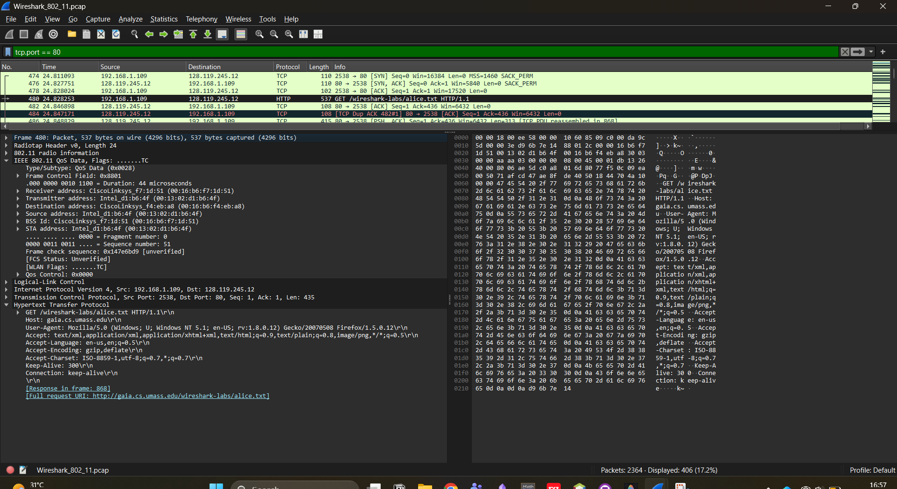
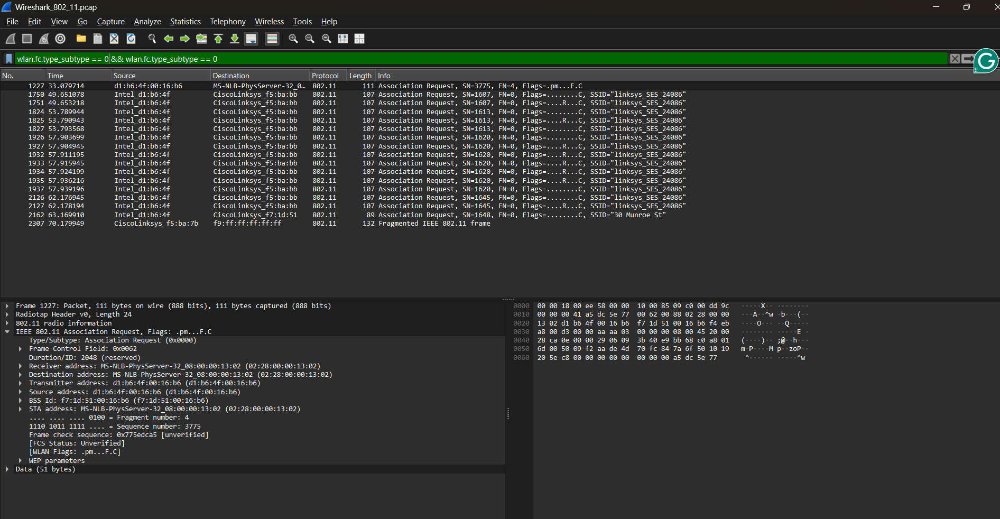
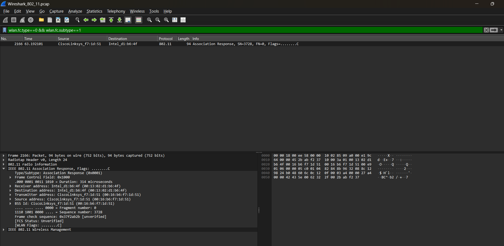
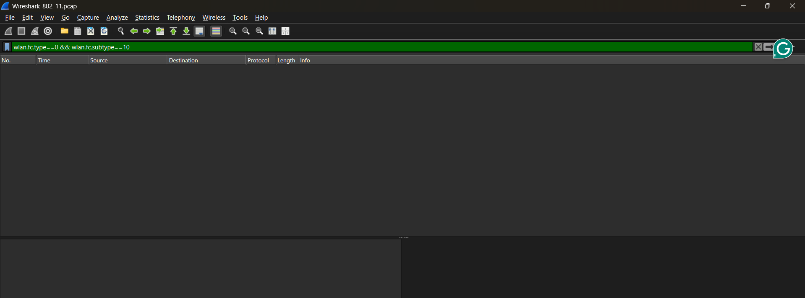

**Nama:** Niko Rajani Syahputra Pane  
**Kelas:** IF-04-04  
**NIM:** 103072400167  

# Modul 14 - Analisis Jaringan Nirkabel (Wireless LAN 802.11)

## Pengantar Tahap Implementasi

Pada praktikum kali ini, kita akan melakukan analisis terhadap paket-paket data yang melintas pada jaringan nirkabel (Wi-Fi) dengan standar 802.11. Dalam kondisi normal, untuk dapat menangkap paket-paket jaringan Wi-Fi secara utuh (seperti paket *Beacon frame* atau *Probe Request*), kartu jaringan nirkabel (*wireless network adapter*) pada komputer kita harus mendukung dan berada dalam mode khusus yang disebut **Monitor Mode**.

Namun, karena sebagian besar kartu jaringan standar pada komputer (khususnya di OS Windows) tidak mendukung pengaktifan *Monitor Mode* secara mudah, kita tidak dapat melakukan *capture* atau merekam lalu lintas Wi-Fi kita sendiri. Sebagai solusinya, kita akan menggunakan file rekaman paket jaringan (*packet trace*) berekstensi `.pcap` yang sudah direkam sebelumnya oleh pembuat modul. File rekaman inilah yang dibungkus dan dibagikan di dalam file `.zip` tersebut.

Berikut adalah langkah-langkah untuk memulai proses analisis:

1. **Mengunduh File Rekaman (*Trace File*)**
   Langkah pertama adalah mengunduh kumpulan file rekaman jaringan yang disediakan. Silakan kunjungi tautan berikut untuk mengunduh file ZIP-nya: 
   [http://gaia.cs.umass.edu/wireshark-labs/wireshark-traces.zip](http://gaia.cs.umass.edu/wireshark-labs/wireshark-traces.zip)

2. **Mengekstrak File ZIP**
   Setelah file `wireshark-traces.zip` berhasil diunduh, ekstrak file tersebut ke dalam sebuah folder di laptop Anda. Di dalam folder hasil ekstraksi, carilah sebuah file bernama `Wireshark_802_11.pcap`. File inilah yang berisi rekaman aktivitas jaringan Wi-Fi target kita.

3. **Membuka File Melalui Wireshark**
   Buka aplikasi Wireshark yang sudah terinstal. Klik menu **File > Open** (atau tekan `Ctrl+O`), lalu arahkan ke lokasi tempat Anda mengekstrak file tadi dan pilih file `Wireshark_802_11.pcap`.

Setelah file tersebut dibuka, Wireshark tidak akan merekam jaringan baru, melainkan akan memuat dan menampilkan ratusan paket Wi-Fi (dengan protokol 802.11) hasil rekaman dari file tersebut. Berikut adalah tampilan awal paket-paket yang akan kita analisis:

## Beacon Frames

Dari ratusan paket hasil rekaman yang terlihat pada tangkapan layar di atas, salah satu jenis paket fundamental yang akan kita bedah pertama kali adalah **Beacon Frames**. Dalam infrastruktur jaringan nirkabel, sebuah router atau *Access Point* (AP) secara berkala memancarkan paket *Beacon* ini ke segala arah (*broadcast*). 

Paket ini pada dasarnya berfungsi sebagai "papan pengumuman digital" yang menyiarkan keberadaan sebuah jaringan Wi-Fi. Berkat *Beacon Frames* inilah, perangkat seperti laptop atau *smartphone* kita dapat mendeteksi daftar nama Wi-Fi (SSID) yang sedang tersedia di sekitar kita, lengkap beserta informasi kapabilitas dan status keamanannya. 

Untuk melihat wujud asli dari paket pengumuman ini, kita dapat melakukan penyaringan (*filtering*) pada Wireshark.

Gunakan filter 'wlan.fc.type_subtype == 8' untuk menampilkan Beacon Frames nya. 

setelah itu pilih salah satu paket untuk melihat lebih detail isi nya:

Berdasarkan rincian paket pada tangkapan layar di atas, kita dapat melihat dengan jelas isi dari sebuah *Beacon Frame*. Pada bagian **IEEE 802.11 Wireless Management**, terlihat bahwa alamat tujuan (*Destination*) dari paket ini adalah *Broadcast* (`ff:ff:ff:ff:ff:ff`), yang membuktikan bahwa pesan ini memang diteriakkan agar dapat ditangkap oleh semua perangkat di sekitarnya. Sementara itu, alamat pengirim (*Source*) dan *BSSID* menunjukkan MAC Address asli dari *Access Point* (router) yang menyiarkannya.

Jika kita liat lebih dalam ke bagian *Tagged parameters*, kita akan menemukan informasi penting yang dibawa oleh broadcast ini, seperti:
- **SSID:** Menampilkan nama jaringan Wi-Fi yang disiarkan, sehingga muncul di perangkat kita (misalnya jaringan bernama "Linksys" atau "eduroam").
- **Beacon Interval:** Menunjukkan jeda waktu antar pengumuman(Broadcast). Biasanya bernilai sekitar 100 milidetik (0,1 detik), yang berarti router memancarkan sinyal keberadaannya berkali-kali dalam satu detik tanpa henti.
- **Supported Rates:** Menginformasikan spesifikasi kecepatan transfer data yang sanggup dilayani oleh router.
- **DS Parameter Set (Channel):** Menunjukkan saluran frekuensi (kanal) keberapa yang sedang digunakan oleh jaringan tersebut.

Kumpulan informasi mendetail inilah yang langsung diserap oleh laptop atau HP kita saat menyalakan Wi-Fi, sehingga proses pencarian dan koneksi jaringan nirkabel dapat berjalan secara mulus secara otomatis.

## Data Transfer

Setelah perangkat kita mengenali router dari pesan *Beacon Frames* dan berhasil terhubung, tahap selanjutnya adalah proses komunikasi yang sesungguhnya. Dalam jaringan Wi-Fi, segala aktivitas kita seperti memuat halaman web, menonton video, atau mengirim pesan, dibawa oleh jenis paket yang disebut **Data Frames**.

Berbeda dengan paket sebelumnya yang hanya berisi pengumuman atau pengaturan jaringan, *Data Frames* bertugas sebagai "truk pengangkut" yang membawa muatan data asli (*payload*) dari aktivitas pengguna. Untuk melihat bagaimana wujud paket pengangkut data ini beroperasi, mari kita kembali menyaring (*filter*) tampilannya di Wireshark.

Gunakan filter 'tcp.port == 80' untuk menampilkan paket untuk lalu lintas HTTP:

Kita bisa memilih salah satu paket untuk melihat proses data transfer nya secara mendetail

Kita dapat melihat bagaimana sebuah data didistribusikan dan ditransfer melalui jaringan nirkabel. Paket yang sedang kita lihat ini adalah sebuah **Data Frame** yang sedang mengangkut (*encapsulate*) pesan jaringan TCP/IP di dalamnya.

Berikut adalah penjelasan mengenai cara kerja pengiriman data tersebut:
1. **Lapisan Nirkabel (IEEE 802.11 Data Frame):** Berbeda dengan kabel LAN konvensional yang hanya butuh dua MAC Address, transfer data via Wi-Fi membutuhkan manajemen pengalamatan yang lebih kompleks (hingga 3 atau 4 MAC Address sekaligus). Alamat-alamat ini secara spesifik mencatat siapa pengirim asli perangkat (*Source*), siapa penerima akhirnya (*Destination*), serta router mana yang bertugas memancarkan atau menangkap sinyal radio tersebut di udara (*Transmitter/Receiver/BSSID*).
2. **Jembatan Standar (Logical Link Control / LLC):** Di dalam struktur paket, terdapat lapisan LLC yang bertugas sebagai jembatan penerjemah. LLC menghubungkan bahasa radio nirkabel (802.11) agar selaras dengan bahasa internet standar, sehingga data bisa selamat diteruskan ke jaringan internet global.
3. **Lapisan Transportasi (IPv4 & TCP):** Di dalam bungkus nirkabel tersebut, tersembunyi paket data inti yang memuat alamat IP dan protokol TCP. Lapisan inilah yang memastikan bahwa data dari internet (misalnya saat kita men-*download* file) bisa dirakit ulang secara berurutan dan dijamin sampai ke perangkat kita tanpa ada satu *byte* pun yang hilang atau rusak.

## Association/Disassociation Frames 

Tahap selanjutnya dalam jaringan nirkabel adalah proses "pendaftaran" (*check-in*) dan "pengunduran diri" (*check-out*) sebuah perangkat, yang dikendalikan oleh **Association** dan **Disassociation Frames**. Setelah menemukan nama Wi-Fi, perangkat akan mengirimkan *Association Request* untuk memohon izin bergabung dan akan mendapatkan akses jaringan penuh jika router membalas dengan *Association Response*. Sebaliknya, ketika perangkat mematikan Wi-Fi atau keluar dari jangkauan, pesan *Disassociation* akan dikirimkan untuk memutuskan koneksi secara baik-baik, sehingga router dapat membebaskan kembali memori dan sumber dayanya. Untuk melihat bukti lalu lintas pendaftaran dan pemutusan ini, kita dapat melakukan penyaringan (*filter*) pada Wireshark.

Gunakan Filter 'wlan.fc.type_subtype == 0' && wlan.fc.type_subtype == 0'(Subtype == 0 artinya association request) untuk menampilkan Association dan Disassociation Frames:

dari gambar diatas, bisa ditemukan beberapa Association Frame reuqest yang di kirimkan ke Access Point dengan SSID 'linksys_SES_24086'. Ada banyak frame yang di tampilkan menandakan bahwa host telah melakuakn beberapa kali percobaan untuk terhubung dengan jaringan tersebut. 

Selanjutnya gunakan filter 'wlan.fc.type==0 && wlan.fc.subtype==1' untuk menampilkan Association Response:

Association Response adalah pesan balasan yang dikirim oleh Access Point kepada host yang meminta koneksi. Pesan ini berisi informasi status koneksi, seperti status keberhasilan koneksi, mode jaringan yang digunakan, dan parameter lainnya.

bisa dilihat dari gambar diatas, hanya ada 1 frame association response yang di kirim oleh access point sebagai balasan request dari host, hal ini menunjukan bahwa host telah berhasil terhubung dengan jaringan tersebut.

Terakhir gunakan filter 'wlan.fc.type==0 && wlan.fc.subtype==10' untuk menampilkan Disassociation:

Gambar diatas menunjukkan tidak ditemukannya paket yang disaring dengan filter tersebut, hal ini menandakan bahwa tidak ada host yang melakukan disassociation dengan access point selama proses perekaman berlangsung.

## Kesimpulan

Secara keseluruhan, praktikum Modul 14 ini memberikan kita gambaran mengenai cara kerja jaringan nirkabel (Wi-Fi 802.11) dari awal hingga akhir. Melalui analisis menggunakan Wireshark, kita dapat menyimpulkan bahwa komunikasi Wi-Fi selalu diawali dengan "pengumuman"(Broadcast) keberadaan jaringan melalui *Beacon Frames*, dilanjutkan dengan proses pendaftaran perangkat melalui *Association Frames* agar mendapatkan izin akses. Setelah koneksi resmi terbentuk, barulah jaringan mengirimkan muatan utama berupa *Data Frames* yang secara otomatis membungkus lalu lintas internet (TCP/IP) layaknya pada jaringan kabel biasa. Dengan kata lain, di balik kepraktisan jaringan Wi-Fi yang kasat mata, terdapat mekanisme pertukaran pesan kontrol yang sangat terstruktur dan kompleks untuk menjamin keamanan serta kelancaran koneksi internet kita sehari-hari.