## Nama: Niko Rajani Syahputra Pane
## Kelas: IF-04-04
## NIM: 103072400167

### Modul 6 TCP
Mengenal mekanisme Three way handshake, TCP Flow Control, TCP Congestion Control, dan TCP retransmission

Sebelum masuk ke dalam praktikumnya, kita perlu melakukan beberapa persiapan 

1. Buka http://gaia.cs.umass.edu/wireshark-labs/alice.txt dan unduh salinan ASCII dari naskah Alice in Wonderland dan simpan di laptop

2. Buka http://gaia.cs.umass.edu/wireshark-labs/TCP-wireshark-file1.html

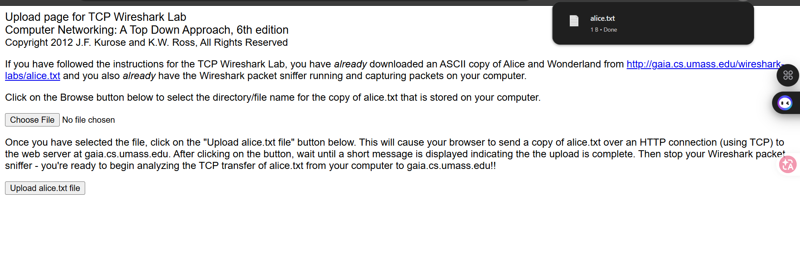

3. Buka wiresharknya dan mulai capture
4. Upload File alice.txt di bagian choose file(web diatas).

5. ketik tcp di kolom filter wiresharknya, lalu hasilnya akan seperti dibawah ini:

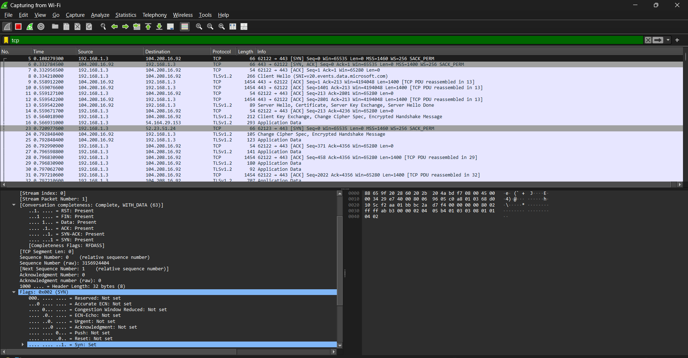

# Pertanyaan 

1. Berapa nomor urut segmen TCP SYN yang digunakan untuk memulai sambungan TCP antara komputer klien dan gaia.cs.umass.edu? Apa yang dimiliki segmen tersebut sehingga teridentifikasi sebagai segmen SYN?
2. Berapa nomor urut segmen SYNACK yang dikirim oleh gaia.cs.umass.edu ke komputer klien sebagai balasan dari SYN? Berapa nilai dari field Acknowledgement pada segmen SYNACK? Bagaimana gaia.cs.umass.edu menentukan nilai tersebut? Apa yang dimiliki oleh segmen sehingga teridentifikasi sebagai segmen SYNACK?
3. Berapa nomor urut segmen TCP yang berisi perintah HTTP POST? Perhatikan bahwa untuk menemukan perintah POST, Anda harus menelusuri content field milik paket di bagian bawah jendela Wireshark, kemudian cari segmen yang berisi "POST" di bagian field DATA nya.
4. Anggap segmen TCP yang berisi HTTP POST sebagai segmen pertama dalam koneksi TCP. Berapa nomor urut dari enam segmen pertama dalam TCP (termasuk segmen yang berisi HTTP POST)? Pada jam berapa setiap segmen dikirim? Kapan ACK untuk setiap segmen diterima? Dengan adanya perbedaan antara kapan setiap segmen TCP dikirim dan kapan acknowledgement-nya diterima, berapakah nilai RTT untuk keenam segmen tersebut? Berapa nilai EstimatedRTT setelah penerimaan setiap ACK? (Catatan: Wireshark memiliki fitur yang memungkinkan Anda untuk memplot RTT untuk setiap segmen TCP yang dikirim. Pilih segmen TCP yang dikirim dari klien ke server gaia.cs.umass.edu pada jendela "daftar 35 JARINGAN KOMPUTER paket yang ditangkap". Kemudian pilih: Statistics->TCP Stream Graph- >Round Trip Time Graph).
5. Berapa panjang setiap enam segmen TCP pertama?
6. Berapa jumlah minimum ruang buffer tersedia yang disarankan kepada penerima dan diterima untuk seluruh trace? Apakah kurangnya ruang buffer penerima pernah menghambat pengiriman?
7. Apakah ada segmen yang ditransmisikan ulang dalam file trace? Apa yang anda periksa (di dalam file trace) untuk menjawab pertanyaan ini?
8. Berapa banyak data yang biasanya diakui oleh penerima dalam ACK? Dapatkah anda mengidentifikasi kasus-kasus di mana penerima melakukan ACK untuk setiap segmen yang diterima?
9. Berapa throughput (byte yang ditransfer per satuan waktu) untuk sambungan TCP? Jelaskan bagaimana Anda menghitung nilai ini.
---

## Jawaban
### 1. Berapa nomor urut segmen TCP SYN yang digunakan untuk memulai sambungan TCP antara komputer klien dan gaia.cs.umass.edu? Apa yang dimiliki segmen tersebut sehingga teridentifikasi sebagai segmen SYN?

dari hasil percobaan, kita dapat hasilnya seperti ini:

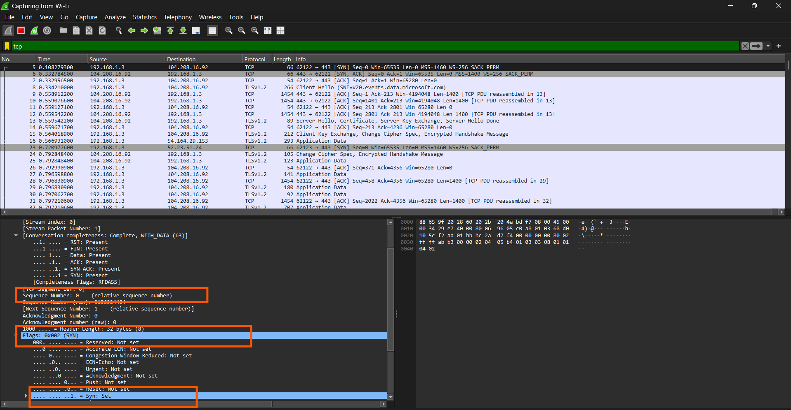

untuk nomor urut segmen TCP SYN adalah 0. Dimana pada gambar diatas ditandai dengan nomor urut 1. 

Lalu Sebuah segmen diidentifikasi sebagai SYN karena nilai pada bagian Flags di header TCP-nya. Di gambar diatas, terlihat bahwa:
- Nilai baris Flags: 0x002 (SYN).
- Jika dibuka lebih detail (pada kotak oranye paling bawah), nilai bit untuk Syn adalah Set (bernilai 1), sedangkan flag lainnya seperti Acknowledgement (ACK), Reset (RST), Fin, dll., bernilai Not set (0). Hal itu menandakan dimulainya proses three-way handshake untuk membuka koneksi.


### 2. Berapa nomor urut segmen SYNACK yang dikirim oleh gaia.cs.umass.edu ke komputer klien sebagai balasan dari SYN? Berapa nilai dari field Acknowledgement pada segmen SYNACK? Bagaimana gaia.cs.umass.edu menentukan nilai tersebut? Apa yang dimiliki oleh segmen sehingga teridentifikasi sebagai segmen SYNACK?


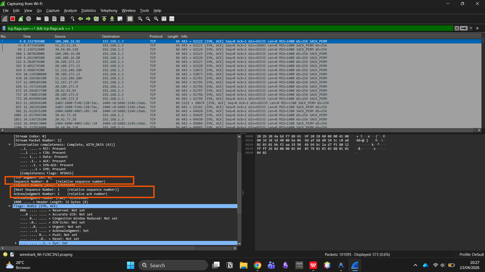

nomor urut (Seq) yang dikirim oleh server gaia.cs.umass.edu adalah 0 (Kotak warna merah pertama).

Lalu untuk nilai acknowledgement nya adalah 1.

untuk pertanyaan bagaimana server menentukan nilai Acknowledgemnt tersebut adalah dengan rumus 
```python
Ack = (Sequence Number SYN dari Klien) + 1
```
Karena pada langkah pertama client ngirim segmen SYN dengan Sequence Number = 0, maka server membalas dengan Ack = 0 + 1 = 1.

Lalu segmen ini teridentifikasi sebagai SYNACK karena di dalam header TCP, pada bagian Flags, terdapat dua flag yang aktif (bernilai 1 atau Set) secara bersamaan:
- Flags: 0x012 (SYN, ACK)
- Jika dilihat detailnya (seperti pada kotak biru di gambar):
Acknowledgment: Set (1)
Syn: Set (1)

Ini adalah langkah kedua dari proses three-way handshake, di mana server menyetujui permintaan koneksi (SYN) sekaligus mengonfirmasi penerimaan (ACK)

### 3. Berapa nomor urut segmen TCP yang berisi perintah HTTP POST? Perhatikan bahwa untuk menemukan perintah POST, Anda harus menelusuri content field milik paket di bagian bawah jendela Wireshark, kemudian cari segmen yang berisi "POST" di bagian field DATA nya.


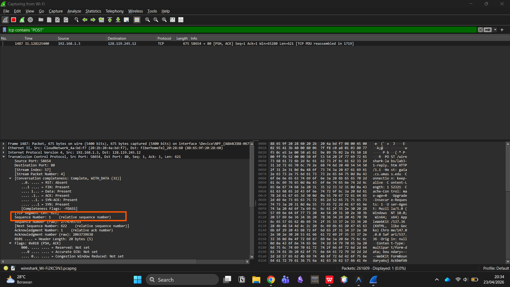

dari gambar diatas, nomor urut segmen TCP yang berisi perintah HTTP POST tersebut adalah 1.

kenapa nomor urutnya 1? Karena ini adalah segmen data pertama yang dikirim oleh client setelah proses three-way handshake selesai. 

Segmen SYN sebelumnya menggunakan nomor 0, dan setelah koneksi mapan, pengiriman data (perintah POST) dimulai dari nomor urut 1.

### 4. Anggap segmen TCP yang berisi HTTP POST sebagai segmen pertama dalam koneksi TCP. Berapa nomor urut dari enam segmen pertama dalam TCP (termasuk segmen yang berisi HTTP POST)? Pada jam berapa setiap segmen dikirim? Kapan ACK untuk setiap segmen diterima? Dengan adanya perbedaan antara kapan setiap segmen TCP dikirim dan kapan acknowledgement-nya diterima, berapakah nilai RTT untuk keenam segmen tersebut? Berapa nilai EstimatedRTT setelah penerimaan setiap ACK?

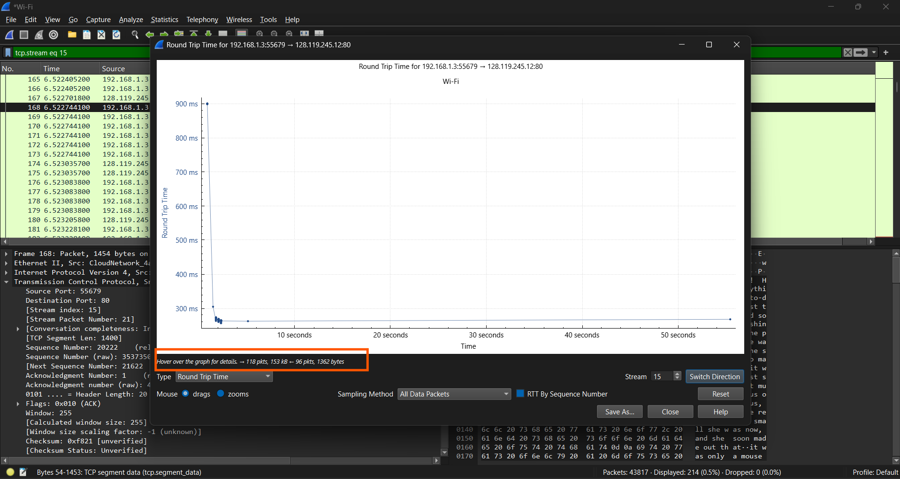

dari hasil gambar di atas, 6 segmen pertamanya adalah:
1. SEQ = 1; Time = 5.6222s, RTT = 900ms
2. SEQ = 13222; Time = 6.222s, RTT = 305 ms
3. SEQ = 18822; Time = 6.522s, RTT = 275 ms
4. SEQ = 27222; Time = 6.523s, RTT = 270 ms
5. SEQ = 328222; Time = 6.523s, RTT = 265 ms
6. SEQ = 356222; Time = 6.543s, RTT = 262 ms

Lalu untuk estimasi RTT nya dihitung dengan rumus

```python
EstimatedRTT = α * EstimatedRTT + (1 − α) * SampleRTT
```
dimana nilai α adalah 0.875

jadi estimasinya

Segmen 1: Estimasi RTT = 900 ms

Segmen 2: (0.875x900)+(0.125x305) = 825.6 ms 

Segmen 3: (0.875x825.6)+(0.125x275) = 756.8 ms

Segmen 4: (0.875x756.8)+(0.125x270) = 6
96.5 ms

Segmen 5: (0.875x696.5)+(0.125x265) = 640.4 ms 

Segmen 6: (0.875x640.4)+(0.125x262) = 588.8 ms 


### 5. Berapa panjang setiap enam segmen TCP pertama?

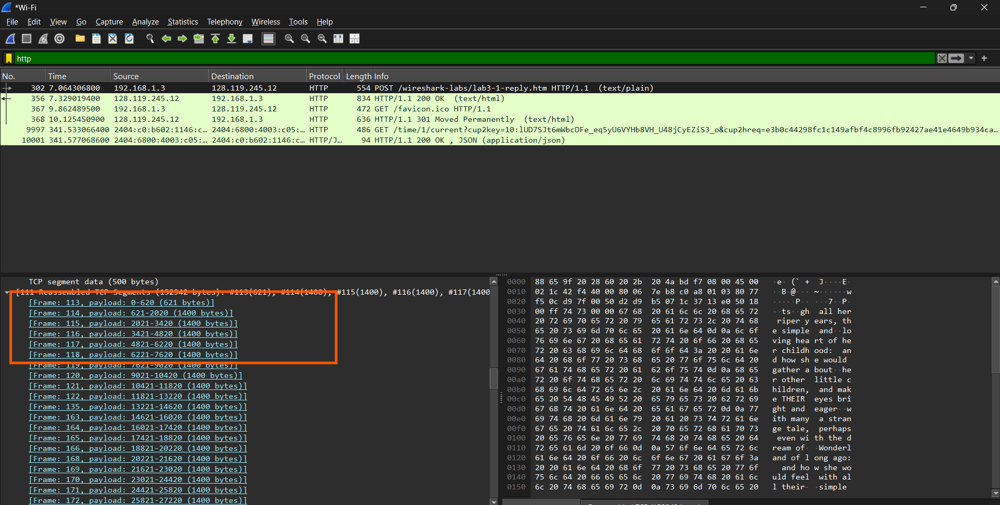

panjang TCp segmen dari 6 segmen pertama adalah:

1. 621 bytes
2. 1400 bytes
3. 1400 bytes
4. 1400 bytes
5. 1400 bytes
6. 1400 bytes

### 6. Berapa jumlah minimum ruang buffer tersedia yang disarankan kepada penerima dan diterima untuk seluruh trace? Apakah kurangnya ruang buffer penerima pernah menghambat pengiriman?

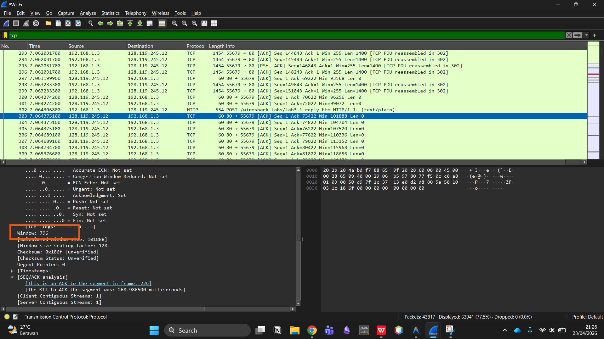

Nilai window size menunjukkan kapasitas buffer penerima yaitu 796 bytes. Dalam trace ini, tidak terlihat adanya indikasi bahwa kurangnya ruang buffer penerima menghambat pengiriman, karena tidak ada segmen yang ditransmisikan ulang atau adanya penurunan throughput yang signifikan.

### 7. Apakah ada segmen yang ditransmisikan ulang dalam file trace? Apa yang anda periksa (di dalam file trace) untuk menjawab pertanyaan ini?

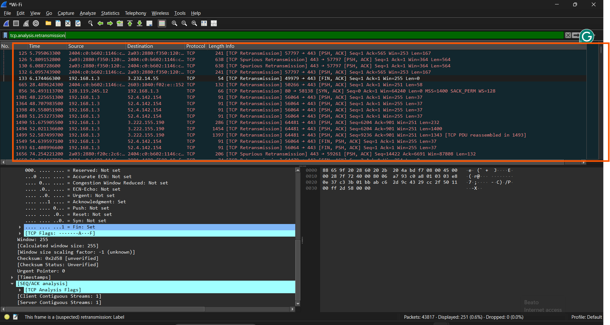

Ada segmen yang retranmission seperti gambar diatas itu.

### 8. Berapa banyak data yang biasanya diakui oleh penerima dalam ACK? Dapatkah anda mengidentifikasi kasus-kasus di mana penerima melakukan ACK untuk setiap segmen yang diterima?

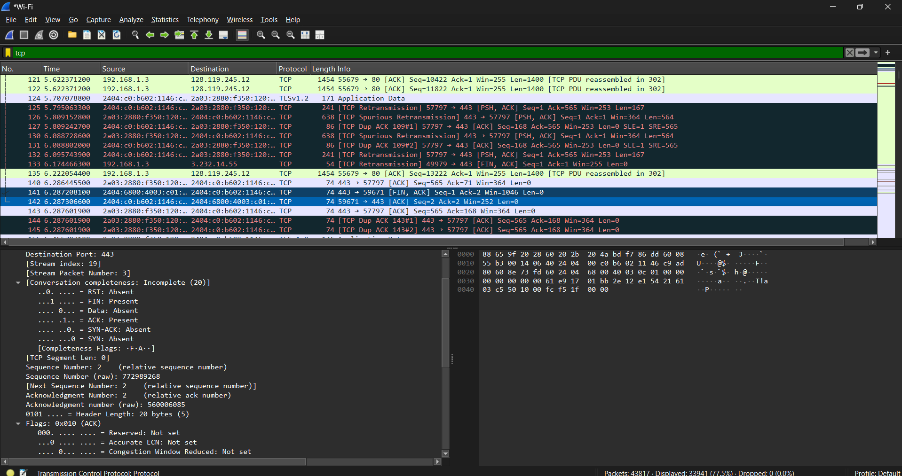

terdapat transmisi ulang yang ditandai dengan label [TCP Retransmission] berwarna hitam. Hal ini diperiksa melalui kolom Info dan TCP Analysis Flags karena adanya paket dengan nomor urut yang sama dikirim berulang kali (akibat gangguan jaringan).

Penerima biasanya mengakui data dalam jumlah 1400 byte (sesuai ukuran segmen). Kasus ACK untuk setiap segmen terjadi jika setiap satu paket data dibalas langsung oleh satu paket ACK. Namun, pada capture kamu sering terjadi Dup ACK, yang berarti penerima meminta ulang data yang hilang karena banyak terjadi retransmisi.

### 9. Berapa throughput (byte yang ditransfer per satuan waktu) untuk sambungan TCP? Jelaskan bagaimana Anda menghitung nilai ini.

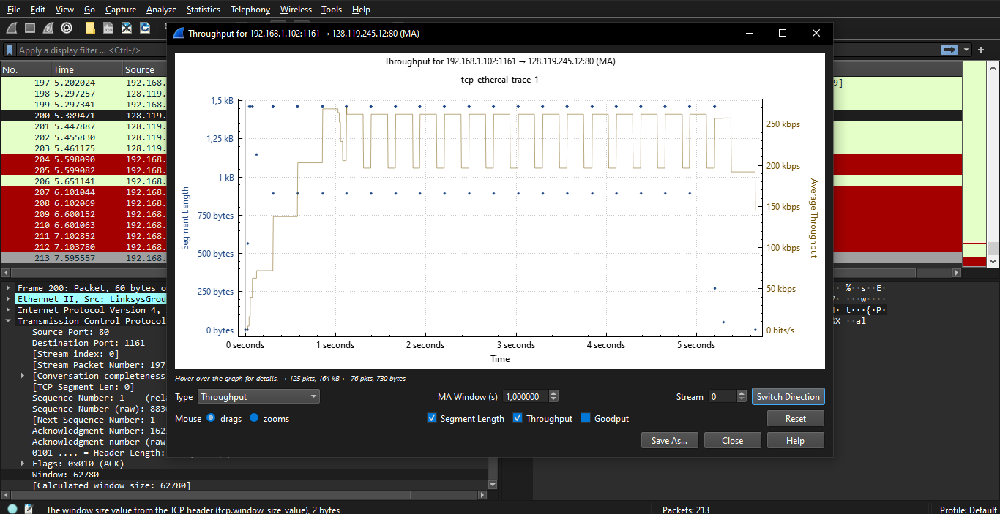

Untuk menghitung throughput, kita dapat menggunakan rumus: Throughput = Total Data Transferred / Total Time

Total Data Transferred = 3.852.979 bytes
Total Time = 8.2768 detik

Throughput = 3.852.979 bytes / 8.2768 detik ≈ 465.526 bytes/detik ≈ 458.09 Kbps

### 10. Gunakan alat plotting Time-Sequence-Graph (Stevens) untuk melihat grafik nomor urut berbanding waktu dari segmen yang dikirim oleh klien ke server gaia.cs.umass.edu. Dapatkah Anda mengidentifikasi di mana fase “slow start” TCP dimulai dan berakhir, dan pada bagian mana algoritma ”congestion avoidance” mengambil alih? Berikan komentar tentang bagaimana data yang diukur berbeda dari perilaku ideal TCP yang telah kita pelajari.


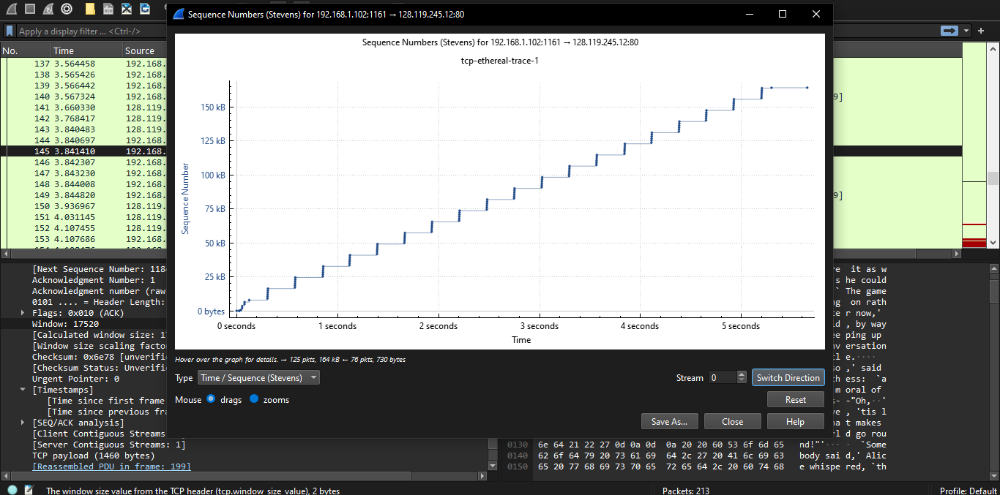

- TCP Slow Start:
Fase ini terjadi di bagian awal grafik, yaitu pada kisaran 0 hingga 0,5 detik. Kamu bisa mengidentifikasinya dari bentuk kurva yang menanjak secara eksponensial (melengkung ke atas). Di sini, jumlah data yang dikirim (nomor urut) meningkat dua kali lipat setiap RTT karena TCP sedang mencoba mencari kapasitas bandwidth yang tersedia.
- TCP Congestion Avoidance:
Fase ini dimulai setelah detik ke ~0,5 hingga akhir grafik (detik ke-5). Kamu bisa melihat perubahannya menjadi garis lurus linear (seperti tangga yang stabil). Pada tahap ini, TCP berhenti meningkatkan pengiriman secara drastis dan beralih ke peningkatan bertahap (menambah 1 MSS setiap RTT) untuk menghindari kemacetan jaringan.
