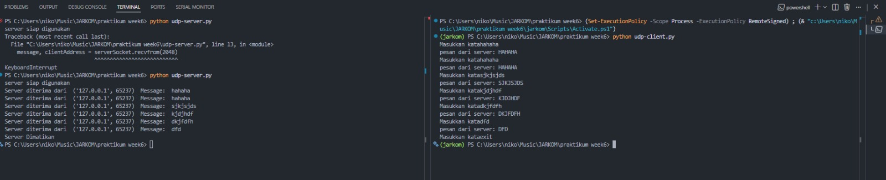
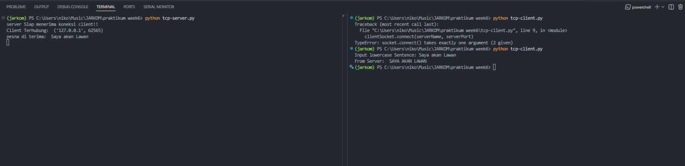

**Nama:** Niko Rajani Syahputra Pane  
**Kelas:** IF-04-04  
**NIM:** 103072400167

# Modul 7 - TCP/UDP

Implementasi Komunikasi Client-Server menggunakan UDP dan TCP

## UDP
Di **UDP**, untuk memulai komunikasi antara client dan server, kita tidak perlu melakukan proses yang di sebut **three way handshake**, sehingga UDP lebih cepat di bandingkan dengan TCP.

Namun UDP tidak memiliki kehandalan seperti TCP, karena UDP tidak memiliki fitur **reliable**.

### Implementasi Kode 

#### 1. UDP Client (`udp-client.py`)
```python
from socket import *

serverName = "localhost"
serverPort = 12000

clientSocket = socket(AF_INET, SOCK_DGRAM)

running = True
while running:
    message = input("Masukkan kata")
    
    if message.lower() == "exit":
        # Kirim "exit" ke server dulu
        clientSocket.sendto(message.encode(), (serverName, serverPort))
        running = False
        continue

    clientSocket.sendto(message.encode(), (serverName, serverPort))

    modifiedMessage, serverAddress = clientSocket.recvfrom(2048)
    print("pesan dari server:", modifiedMessage.decode())

clientSocket.close()
```

#### 2. UDP Server (`udp-server.py`)
```python
from socket import *

serverName = "localhost"
serverPort = 12000

clientSocket = socket(AF_INET, SOCK_DGRAM)

running = True
while running:
    message = input("Masukkan kata")
    
    if message.lower() == "exit":
        # Kirim "exit" ke server dulu
        clientSocket.sendto(message.encode(), (serverName, serverPort))
        running = False
        continue

    clientSocket.sendto(message.encode(), (serverName, serverPort))

    modifiedMessage, serverAddress = clientSocket.recvfrom(2048)
    print("pesan dari server:", modifiedMessage.decode())

clientSocket.close()
```

#### 3. Output 




#### 4. Penjelasan
Bagaimana sebenarnya cara kerja dari UDP pada code diatas?

Pada dasarnya cara kerjanya sangat simpel, pada client, ia akan mengirimkan data ke server, tanpa melakukan proses **three way handshake**, setelah itu client akan menerima data dari server, lalu akan di *decode*, lalu akan di *print*.

---

### Penjelasan Kode nya

#### UDP Client

**1.** Pertama kita import dulu socketnya, baik di sisi client maupun server
```python
from socket import *
```
Kode diatas akan melakukan import semua fungsi dari modul `socket`, yang memungkinkan kita mendapat akses ke fungsi pembuatan socket, binding, mengirim/menerima data dll. 

**2.** Atur serverport atau jalur pengiriman yang akan di gunakan
```python
serverName = "localhost"
serverPort = 12000
```
- `serverName` berarti mengambil seluruh jalur ip yang tersedia pada komputer kita. 
- Sedangkan `serverPort` adalah nomor jalur yang akan di gunakan, untuk port ini bisa saja di ubah, asalkan client dan server memiliki nomor port yang sama.

**3.** Buat socket khusus untuk UDP
```python
clientSocket = socket(AF_INET, SOCK_DGRAM)
```
Perintah ini akan membuat socket khusus untuk UDP, dengan menggunakan `AF_INET` sebagai tipe alamat (IPv4), dan `SOCK_DGRAM` sebagai tipe socket (UDP).

**4.** Buat loop while agar dapat mengirim pesan sampai user mengetik "exit"
```python
while running:
    ...

```

**5.** Minta input dari user
```python
message = input("Masukkan kata")

if message.lower() == "exit":
    # Kirim "exit" ke server dulu
    clientSocket.sendto(message.encode(), (serverName, serverPort))
    running = False
    continue

clientSocket.sendto(message.encode(), (serverName, serverPort))
```
Lalu membaca pesan yang di kirim, Jika user mengetik exit (di ubah ke lowercase) maka:

- Kirim `"exit"` ke server dlu dengan `sendto`, lalu ubah string ke bytes dengan `encode()`, terakhir atur alamat tujuan nya (`localhost:12000`).
- Set variable `running = False` agar while loop berhenti
- `continue` agar tidak lanjut ke bawah

**6.** Lalu kita tunggu balasan dari server dengan kode
```python
modifiedMessage, serverAddress = clientSocket.recvfrom(2048)
print("pesan dari server:", modifiedMessage.decode())
```

`recvfrom` Berfungsi untuk menerima pesan dari server, lalu di simpan di dalam variable `modifiedMessage`, sedangkan untuk alamat server disimpan di dalam `serverAddress`.

**7.** Lalu tinggal print hasilnya dengan `decode()`.
```python
print("pesan dari server:", modifiedMessage.decode())
```

**8.** Terakhir adalah menutup socket
```python
clientSocket.close()
```

#### UDP Server

Untuk di bagian server kurang lebih sama dengan di bagian client

**1.** Import module socket nya 

```python
from socket import *
```

**2.** Atur serverport atau jalur pengiriman yang akan di gunakan
```python
serverName = "localhost"
serverPort = 12000
```

**3.** Buat socket khusus untuk UDP
```python
serverSocket = socket(AF_INET, SOCK_DGRAM)
```

**4.** Binding socket 
```python
serverSocket.bind((serverName, serverPort))
```

Fungsi `bind()` ini akan mengikat socket server ke alamat IP (`localhost`) dan nomor port (`12000`) yang telah ditentukan.
Jadi server siap menerima data di port 12000 dari siapa saja.

**5.** Buat loop while agar dapat menerima pesan dari client
```python
while running:
    ...
```

**6.** Menerima pesan dari client
```python
while running:
    message, clientAddress = serverSocket.recvfrom(2048)
    ...
```

`recvfrom()` Berfungsi untuk menerima pesan dari client, lalu di simpan di dalam variable `message`, sedangkan untuk alamat client disimpan di dalam `clientAddress`.

**7.** Ubah pesan menjadi uppercase lalu kirim kembali ke client
```python
serverSocket.sendto(message.upper().encode(), clientAddress)
```

- Mengubah pesan menjadi uppercase dengan `upper()`
- Mengubah string menjadi bytes dengan `encode()`
- Terakhir mengirim pesan ke client dengan `sendto()`, dengan mengatur alamat tujuan nya (`localhost:12000`).

**8.** Terakhir adalah menutup socket
```python
serverSocket.close()
```
---

## TCP

Pada **TCP**, untuk memulai komunikasi antara client dan server, kita perlu melakukan proses yang di sebut **three way handshake**, sehingga TCP lebih lambat di bandingkan dengan UDP.

Namun TCP memiliki kehandalan seperti TCP, karena TCP memiliki fitur **reliable**.

### Implementasi Kode 

#### 1. TCP Client (`tcp-client.py`)
```python
from socket import *

serverName = "localhost"
serverPort = 8080

clientSocket = socket(AF_INET, SOCK_STREAM)

#koneksi ke server
clientSocket.connect((serverName, serverPort))

sentence = input("Input lowercase Sentence: ")

clientSocket.send(sentence.encode())

modifiedSentence = clientSocket.recv(2048)
print("From Server: ", modifiedSentence.decode())

clientSocket.close()
```

#### 2. TCP Server (`tcp-server.py`)
```python
from socket import *

serverPort = 8080

serverSocket = socket(AF_INET, SOCK_STREAM)

serverSocket.bind(('', serverPort))

serverSocket.listen(5)
print("server Siap menerima koneksi client!! ")
print("Tekan Ctrl+C untuk menghentikan server.")

serverSocket.settimeout(1)

try: 
    while True:
        try:
            connectionSocket, addr = serverSocket.accept()
            print("Client Terhubung: ", addr)
            sentence = connectionSocket.recv(2048).decode()

            print("pesna di terima: ", sentence)

            modifiedSentence = sentence.upper()
            connectionSocket.send(modifiedSentence.encode())

            connectionSocket.close()
        except timeout:
            continue
except KeyboardInterrupt:
    print("Server di hentikan")

finally:
    serverSocket.close()
```

#### 3. Output 




#### 4. Penjelasan

Karena kita menggunakan TCP, maka akan ada proses **three way handshake** terlebih dahulu, artinya kita perlu terkoneksi, perlu melakukan persiapan sebelum mengirimkan suatu data ke server

---

### Penjelasan Kode

#### TCP Server

**1.** Pertama import socket
```python
from socket import *
```

**2.** Atur port yang akan di gunakan
```python
serverName = "localhost"
serverPort = 8080
```

**3.** Buat socket
```python
clientSocket = socket(AF_INET, SOCK_STREAM)
```
Kita menggunakan `SOCK_STREAM` karena menggunakan TCP

**4.** Mengikat socket ke semua alamat lokal dan port 8080

```python
serverSocket.bind(("", serverPort))
```
**5.** Disini untuk memastikan server hanya dengan Ctrl+C (yang sebelumnya tidak bisa)
kita akan menjalankan server dalam mode mendengarkan 
```python
serverSocket.listen(5)
print("server Siap menerima koneksi client!! ")
print("Tekan Ctrl+C untuk menghentikan server.")

```

Dengan begitu server akan mendengarkan inputan keyboard kita. 
**6.** Menampilkan bahwa server aktif
```python
serverSocket.settimeout(1)
```
Membuat `accept` dan jika tidak ada koneksi maka akan timeout 1 detik, lalu lanjut ke while true lagi, dan seterusnya. 

**7.** Lakukan proses three way handshake
```python
 connectionSocket, addr = serverSocket.accept()
            print("Client Terhubung: ", addr)
```
`connectionSocket` Berfungsi untuk menerima koneksi dari client, sedangkan `addr` menyimpan alamat IP dan port dari client.

**8.** Menerima pesan dari client
```python
sentence = connectionSocket.recv(2048).decode()
```

**9.** Menampilkan pesan yang diterima dari client dengan 
```python
modifiedSentence = sentence.upper()
```
Lalu langsung mengirim balasan kembali ke client dengan 
```python
connectionSocket.send(modifiedSentence.encode())
```

Ini adalah proses **SYNACK**, yaitu pengiriman balasan dari server bahwa server setuju untuk melakukan koneksi. 

**10.** Tutup socket nya dengan 
```python
connectionSocket.close()
```
Lalu terakhir, jika timeout 1 detik, maka loop akan terus berjalan, ini agar server tetap bisa di hentikan dengan Ctrl+C


#### TCP Client

**1.** Import socket
```python
from socket import *
```

**2.** Atur port yang akan di gunakan
```python
serverName = "localhost"
serverPort = 8080
```

**3.** Buat socket khusus TCP
```python
clientSocket = socket(AF_INET, SOCK_STREAM)
```

**4.** Binding socket ke port yang di tentukan
```python
clientSocket.bind(("", serverPort))
```

Ini akan membuka koneksi ke server, ini proses **SYN** sebagai langkah awal dari **three way handshake**.

**5.** Meminta input dari user sekaligus mengirim nya ke server lewat koneksi TCP

```python
sentence = input("Input lowercase Sentence: ")

clientSocket.send(sentence.encode())
```

**6.** Menerima balasan dari server

```python
modifiedSentence = clientSocket.recv(2048)
print("From Server: ", modifiedSentence.decode())
```

**7.** Lalu terakhir tinggal tutup koneksinya.
```python
clientSocket.close()
```
