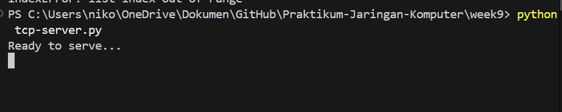
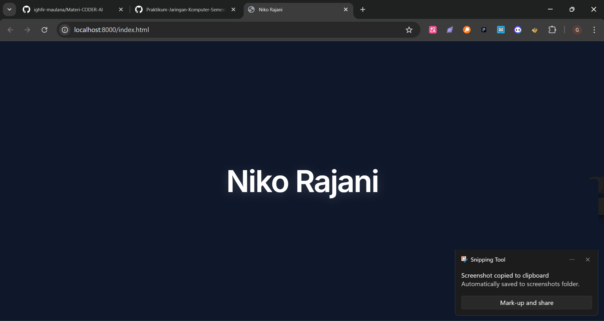

**Nama:** Niko Rajani Syahputra Pane  
**Kelas:** IF-04-04  
**NIM:** 103072400167

# Modul 9 - Web Server Sederhana

Pada modul ini, kita mengimplementasikan sebuah Web Server sederhana menggunakan protokol TCP. Server ini bertugas untuk menerima *request* (permintaan) dari web browser (client) dan meresponsnya dengan mengirimkan file HTML.

## 1. TCP Server (`tcp-server.py`)
```python
from socket import *
import sys 

serverSocket = socket(AF_INET, SOCK_STREAM)
serverPort = 8000

serverSocket.bind(("", serverPort))
serverSocket.listen(1)

while True:
    print('Ready to serve...')
    connectionSocket, addr = serverSocket.accept()
    
    try:
        message = connectionSocket.recv(1024).decode()
        filename = message.split()[1]
        f = open(filename[1:]) 
        outputdata = f.read()
        connectionSocket.send("HTTP/1.1 200 OK\r\n\r\n".encode())
        
        for i in range(0, len(outputdata)):
            connectionSocket.send(outputdata[i].encode())
        
        connectionSocket.send("\r\n".encode())
        connectionSocket.close()
        
    except IOError:
        connectionSocket.send("HTTP/1.1 404 Not Found\r\n\r\n".encode())
        connectionSocket.send("<html><head></head><body><h1>404 Not Found</h1></body></html>\r\n".encode())
        
        connectionSocket.close()

serverSocket.close()
sys.exit()
```

## 2. File HTML (`index.html`)
```html
<!DOCTYPE html>
<html lang="en">
<head>
    <meta charset="UTF-8">
    <meta name="viewport" content="width=device-width, initial-scale=1.0">
    <title>Niko Rajani</title>
    <!-- Import Inter font dari Google Fonts -->
    <link rel="preconnect" href="https://fonts.googleapis.com">
    <link rel="preconnect" href="https://fonts.gstatic.com" crossorigin>
    <link href="https://fonts.googleapis.com/css2?family=Inter:wght@400;600&display=swap" rel="stylesheet">
    <style>
        body {
            margin: 0;
            padding: 0;
            height: 100vh;
            display: flex;
            justify-content: center;
            align-items: center;
            /* Saya gunakan background gelap (navy/hitam) agar teks putih bisa terbaca */
            background-color: #0f172a; 
            font-family: 'Inter', sans-serif;
            color: #ffffff; /* Teks berwarna putih */
        }
        h1 {
            font-size: 4rem;
            font-weight: 600;
            letter-spacing: -0.03em;
            /* Sedikit efek glow agar terlihat lebih modern */
            text-shadow: 0 4px 20px rgba(255, 255, 255, 0.15);
        }
    </style>
</head>
<body>
    <h1>Niko Rajani</h1>
</body>
</html>
```

## 3. Output 

### Server Dinyalakan di Terminal
Server berjalan dan memunculkan tulisan bahwa server telah siap menerima permintaan koneksi (*Ready to serve...*).


### Tampilan Web Berhasil (HTTP 200 OK)
Browser membuka UI HTML yang dikirimkan oleh server saat pengguna mengakses `http://localhost:8000/index.html`.


### File Tidak Ditemukan (HTTP 404 Not Found)
Jika mencari / mengetikkan nama file yang tidak ada di direktori URL, server akan memberikan halaman error 404 dari respons blok pengecualian.


---

## 4. Penjelasan Cara Kerja Web Server

Bagaimana sebenarnya cara kerja Web Server (*TCP Server*) ini hingga bisa membuka file HTML pada browser? Berikut adalah penjelasan rinci alurnya berdasarkan kode yang dibuat:

### 1. Inisialisasi dan Mengikat Port (Binding)
```python
serverSocket = socket(AF_INET, SOCK_STREAM)
serverPort = 8000
serverSocket.bind(("", serverPort))
serverSocket.listen(1)
```
- Pertama, program membuat soket TCP dengan flag `SOCK_STREAM` (Protokol TCP).
- Mengikat (*binding*) soket tersebut untuk mendengarkan port `8000` di dalam komputer *localhost*. 
- `listen(1)` mengatur soket server ini agar siap mendengarkan dan mengantre permintaan maksimal 1 koneksi dalam 1 waktu. 

### 2. Menunggu Koneksi Client (Browser)
```python
while True:
    print('Ready to serve...')
    connectionSocket, addr = serverSocket.accept()
```
- Blok `while True` digunakan agar server hidup dan beroperasi secara *continuous* (terus-menerus tiada henti).
- Fungsi `accept()` akan membuat program berhenti sejenak (terblokir) dan **menunggu** hingga ada *client* (seperti Google Chrome atau *browser* lain) yang terhubung. 
- Ketika pengguna menekan enter di `http://localhost:8000/index.html`, fungsi `accept()` akan menerima koneksinya.

### 3. Membaca Request HTTP
```python
message = connectionSocket.recv(1024).decode()
```
Ketika browser terhubung, ia akan mengirimkan pesan bernama *HTTP Request* yang berformat contohnya `GET /index.html HTTP/1.1`.
- `recv(1024)` digunakan untuk menangkap / membaca byte request yang dikirimkan *browser* dengan maksimal ukuran blok penangkapan 1024 byte.
- Fungsi `.decode()` digunakan untuk mengubah pesan yang aslinya berupa *byte* tersebut menjadi tipe data String biasa supaya bisa diproses oleh Python.

### 4. Mengekstrak Nama File (Parsing)
```python
filename = message.split()[1]
```
- Kalimat *HTTP Request* dipecah / displit menjadi list *array* berdasarkan spasinya. 
- Karena isinya adalah `GET /index.html HTTP/1.1`, maka indeks kedua alias letak `[1]` adalah string `/index.html`. Inilah nama file yang diinginkan user.

### 5. Membuka File HTML Lokal
```python
f = open(filename[1:]) 
outputdata = f.read()
```
- Program kemudian membuang karakter miring `/` yang ada di awalan menggunakan mekanisme *slicing* `[1:]`, sehingga string `/index.html` hanya tersisa `index.html`.
- Melalui blok `open()`, Python akan mencoba membuka dan membaca (*read*) seluruh isi file HTML asli secara sistem file di dalam PC.

### 6. Mengirim Respons Sukses & Data Konten
```python
connectionSocket.send("HTTP/1.1 200 OK\r\n\r\n".encode())
        
for i in range(0, len(outputdata)):
    connectionSocket.send(outputdata[i].encode())
```
- Jika file benar-benar ada dan berhasil dimuat, server *harus* membalas sesuai standar protokol web agar browser memahaminya. Oleh karena itu, *response* pertama yang dikirim adalah **HTTP Status OK**, yaitu string pesan `"HTTP/1.1 200 OK\r\n\r\n"`. 
- Setelah Header HTTP terkirim, loop `for` akan mengeksekusi pengiriman data berupa *line-per-line* baris kode file `index.html` asli tersebut.

### 7. Menutup Koneksi (Proses Tampil)
```python
connectionSocket.send("\r\n".encode())
connectionSocket.close()
```
- Menutup pengiriman isi file dengan baris kosong atau newline `\r\n`.
- Setelah semua bit file terkumpul, server memutuskan sambungan dengan *client* untuk sesi tersebut menggunakan `close()`.
- Browser lalu menerima data HTML tersebut dan akan mulai melakukan *rendering* UI halaman sehingga Anda bisa melihat hasil *background* gelap dan teks namanya dengan sempurna.

### 8. Penanganan Error (404 Not Found)
```python
except IOError:
    connectionSocket.send("HTTP/1.1 404 Not Found\r\n\r\n".encode())
    connectionSocket.send("<html><head></head><body><h1>404 Not Found</h1></body></html>\r\n".encode())
    connectionSocket.close()
```
- Bagaimana jika orang mencari file yang **tidak dibuat/tidak ada**? (misalnya `http://localhost:8000/ngasal.html`).
- Jika file itu tidak ditemukan, maka fungsi `open(filename)` akan gagal dan menyebabkan program meloncat (*error*) ke *exception* tipe `IOError`.
- Server lalu akan menangani error ini dengan mengeksekusi blok `except`, dan membalas pengguna dengan **HTTP Status Code 404 Not Found**. 
- Server juga memberikan struktur halaman HTML sederhana sementara bertuliskan pesan *404 Not Found* di layarnya agar pengguna tak kebingungan kenapa halamannya tidak ada.
